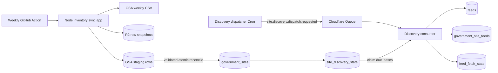

# Implementation Plan: GSA Inventory and Feed Discovery

**Date:** 2026-07-17
**Owner:** Vincent Le / independent project
**Type:** Backend, infrastructure, and external-data integration
**Status:** Draft for implementation after the infrastructure bootstrap branch

## Problem Statement

The pipeline needs a trustworthy, continuously maintained inventory of federal websites before it can discover and poll government news feeds. The GSA Federal Website Index is a changing source snapshot rather than an RSS catalog: it identifies government website hostnames, includes filtered and inactive-looking records, and can add, remove, or reclassify sites between releases.

The system must ingest that source without corrupting the last known-good inventory, schedule feed discovery independently from inventory metadata, preserve the provenance between websites and canonical feeds, and hand newly discovered feeds to a later polling implementation. It must also remain polite to concentrated government domains and operate within the initial Supabase and Cloudflare resource constraints.

## Proposed Solution

Extend the infrastructure bootstrap with two connected workflows:

1. **Inventory reconciliation:** a weekly scheduled GitHub Actions job runs a Node batch application. It downloads the CSV, archives the raw snapshot in R2, loads every source row into a Supabase staging table, validates the complete snapshot, and atomically reconciles `government_sites`.
2. **Feed discovery:** reconciliation makes new, reactivated, and materially changed sites due in `site_discovery_state`. A lightweight recurring dispatcher claims a small number of due sites, discovers and validates feeds, canonicalizes them into `feeds`, records provenance through `government_site_feeds`, and seeds `feed_fetch_state` for the later polling phase.

Supabase is the durable source of truth. GitHub Actions owns only the weekly batch schedule. Cloudflare Cron and Queue own only bounded site-discovery dispatch and are not the authoritative backlog. If a discovery message expires or is retried, due state and leases in Supabase allow work to resume safely.

This intentionally resolves an earlier architecture option: do not add Supabase Cron or Supabase Edge Functions. The approximately 8.2 MB GSA CSV is batch work that does not fit the Cloudflare Free Worker's 10 ms CPU budget, so the weekly inventory job runs once in GitHub Actions. The Cloudflare Worker remains responsible for small scheduled control messages and network-bound discovery work. Never configure the same workflow in more than one scheduler.

## Goals

1. Keep a versioned, queryable, and historically explainable inventory derived from GSA.
2. Never replace the last known-good inventory with a partial or malformed upstream snapshot.
3. Make synchronization and discovery idempotent and safe to retry.
4. Discover RSS, Atom, and optionally JSON Feed endpoints without crawling entire sites.
5. Represent the real cardinality: a website may expose many feeds and one canonical feed may be advertised by many website records.
6. Separate website rediscovery scheduling from future feed-fetch scheduling.
7. Complete the initial discovery backfill gradually without overwhelming shared government infrastructure.
8. Produce enough operational evidence to diagnose source changes, failed discoveries, and stale leases.

## Non-Goals

- Polling discovered feeds for new entries.
- Parsing and storing feed entries.
- Article-body crawling or full-site crawling.
- WebSub subscription delivery.
- Embeddings, clustering, ranking, search, or a public news API.
- A dashboard or administrative UI.
- Replacing the GSA list with an independently maintained government-domain registry.
- Automatically scraping news listing pages when a site has no valid feed.
- Production-scale multi-region deployment.

## Foundation Branch Contract

Do not begin this plan until the minimal infrastructure bootstrap is merged or its final paths are known. This plan expects the foundation branch to provide:

- A pnpm TypeScript workspace.
- `apps/pipeline-worker/` with `scheduled()`, `queue()`, and `fetch()` handlers.
- A versioned `PipelineEvent` contract under `packages/contracts/`.
- A Supabase project, `supabase/config.toml`, and additive migration workflow.
- One Cloudflare Queue with a dead-letter queue.
- One R2 artifact bucket.
- Cloudflare bindings for the queue, R2, and server-side Supabase access.
- Vitest, lint, typecheck, CI, and infrastructure runbooks.
- A GitHub repository capable of running the existing CI workflow; this branch will add narrowly scoped secrets and one scheduled batch workflow.

If the foundation branch changes those names, update the paths in this plan before implementation. Do not recreate a parallel Worker, queue abstraction, database client, or event envelope.

The current GSA CSV is approximately 8.2 MB (7.8 MiB) and 29,500 rows. Unlike the foundation heartbeat's small JSON payload, parsing and staging this file is real batch work and must pass an explicit Node memory, Supabase request, payload-size, and end-to-end runtime benchmark before the scheduled workflow is enabled.

## Requirements

1. The inventory sync uses the GSA `data/site-scanning-target-url-list.csv` source and records the source URL, `ETag` when available, SHA-256 checksum, row count, and timestamps for every attempt.
2. An unchanged source checksum results in a successful no-op.
3. CSV parsing uses a standards-compliant streaming parser; it must not split rows or columns on literal commas.
4. Every candidate snapshot is staged and validated before it can modify `government_sites`.
5. Required-column failure, duplicate keys, a suspicious row-count decrease, or an incomplete download aborts reconciliation and leaves the current inventory unchanged.
6. Present rows are upserted; missing rows are soft-deactivated, never deleted.
7. All GSA rows are retained for audit, but only `inventory_active = true AND gsa_filtered = false` sites are eligible for discovery.
8. The sync makes new, reactivated, and newly eligible sites due immediately without resetting unrelated discovery history.
9. Agency, bureau, analytics, or source-list-only changes do not by themselves trigger rediscovery.
10. Site discovery is lease-based and safe across retries or concurrent consumers.
11. Discovery starts with standards-based HTML feed autodiscovery and applies only bounded fallbacks.
12. Every redirect and candidate URL is validated for allowed scheme, host, port, response size, and redirect count.
13. Canonical feed URLs are globally unique, while website-to-feed relationships retain discovery method and first/last-seen timestamps.
14. Successful discovery schedules the next site rediscovery; transient failures use exponential backoff; permanent ineligibility disables discovery.
15. Newly discovered feeds receive `feed_fetch_state` with `next_fetch_at = now()`, but no feed-fetch worker is implemented in this phase.
16. The initial 25,000-plus-site backfill is rate-limited and can be paused without losing due work.
17. Backend tables expose no anonymous write path and service-only RPC functions are not executable by public roles.
18. Metrics distinguish inventory-sync failures, discovery failures, no-feed results, feed candidates rejected, canonical feeds created, and existing feeds reused.

## Technical Approach

### Architecture Overview



### Scheduling Decisions

- Run `.github/workflows/gsa-inventory-sync.yml` on Thursday at `04:17 UTC`, after the documented Wednesday evening GSA publication window and away from GitHub's busiest top-of-hour scheduling window.
- Support `workflow_dispatch` and `pnpm inventory:sync` so the same batch can be run manually. The workflow uses `concurrency` to prevent overlapping syncs; the database advisory lock remains the final protection.
- Run a lightweight discovery-dispatch Cron every minute initially. Each event causes the consumer to claim at most one due site from Supabase, keeping landing-page requests, redirect hops, feed candidates, and Supabase RPC calls within one Worker's subrequest budget.
- Configure conservative queue-consumer concurrency during the initial backfill. The database remains the durable backlog, so the dispatcher should not pre-enqueue all sites.
- Set initial rediscovery cadence to:
  - New/reactivated site: immediately.
  - Successful discovery with at least one healthy feed: 90 days.
  - Successful discovery with no feed: 30 days for the first retry, then 90 days.
  - Transient network or server failure: exponential backoff from 1 hour to 7 days.
  - Feed later becomes invalid: make associated eligible sites due immediately.
  - Filtered, inactive, or manually suppressed site: disabled until eligibility changes.

The discovery dispatcher is separate from the weekly inventory trigger because failure-driven rediscovery should not wait up to seven days. It still uses the same `site_discovery_state` populated by the inventory reconciliation.

## Data Model Changes

Create two additive migrations after the bootstrap migration:

- `supabase/migrations/20260717000200_create_government_site_inventory.sql`
- `supabase/migrations/20260717000300_create_feed_discovery.sql`

The first migration owns inventory reconciliation and due-site scheduling. The second owns canonical feeds, website-to-feed provenance, and the polling handoff. Splitting them keeps the weekly inventory usable even if feed discovery needs additional iteration. Use `TIMESTAMPTZ`, database-generated UUIDs, explicit check constraints, and additive indexes.

Enforce these ownership boundaries throughout the code:

```text
government_sites 1 -> 0..1 site_discovery_state
government_sites M <-> N feeds through government_site_feeds
feeds 1 -> 1 feed_fetch_state
```

Inventory reconciliation writes `government_sites` and eligibility-driven discovery state. Discovery writes feeds, provenance, and initial fetch state. Only the later polling scheduler may claim `feed_fetch_state`; this branch never treats `government_site_feeds` as a polling queue.

### `public.inventory_sync_runs`

One row per attempted source synchronization:

```text
id UUID PRIMARY KEY
source TEXT NOT NULL
status TEXT NOT NULL CHECK (status IN ('running', 'unchanged', 'succeeded', 'failed'))
source_url TEXT NOT NULL
source_etag TEXT NULL
source_sha256 TEXT NULL
source_row_count INTEGER NULL
staged_count INTEGER NOT NULL DEFAULT 0
inserted_count INTEGER NOT NULL DEFAULT 0
updated_count INTEGER NOT NULL DEFAULT 0
reactivated_count INTEGER NOT NULL DEFAULT 0
deactivated_count INTEGER NOT NULL DEFAULT 0
error_code TEXT NULL
error_detail TEXT NULL
started_at TIMESTAMPTZ NOT NULL DEFAULT now()
completed_at TIMESTAMPTZ NULL
```

Index `(source, started_at DESC)` and prevent more than one running GSA finalization through an advisory lock in the reconciliation function.

### `private.gsa_inventory_stage`

Persistent staging is required because the GitHub-hosted Node batch will insert the snapshot through multiple bounded Supabase requests:

```text
sync_run_id UUID NOT NULL REFERENCES inventory_sync_runs(id) ON DELETE CASCADE
source_row_number INTEGER NOT NULL
initial_url TEXT NOT NULL
base_domain TEXT NOT NULL
top_level_domain TEXT NOT NULL
branch TEXT NULL
agency TEXT NULL
bureau TEXT NULL
gsa_filtered BOOLEAN NOT NULL
source_record JSONB NOT NULL
source_row_hash TEXT NOT NULL
discovery_input_hash TEXT NOT NULL
PRIMARY KEY (sync_run_id, source_row_number)
```

Stage by source row number rather than normalized URL so a duplicate upstream key cannot be hidden by an upsert. Finalization must reject duplicate `(sync_run_id, initial_url)` values. `source_row_hash` detects any source change for audit. `discovery_input_hash` contains only fields that affect reachability or eligibility; agency or analytics changes must not cause rediscovery.

### `public.government_sites`

```text
id UUID PRIMARY KEY
source TEXT NOT NULL DEFAULT 'gsa_federal_website_index'
initial_url TEXT NOT NULL
base_domain TEXT NOT NULL
top_level_domain TEXT NOT NULL
branch TEXT NULL
agency TEXT NULL
bureau TEXT NULL
gsa_filtered BOOLEAN NOT NULL
inventory_active BOOLEAN NOT NULL DEFAULT true
source_row_hash TEXT NOT NULL
discovery_input_hash TEXT NOT NULL
first_seen_at TIMESTAMPTZ NOT NULL
last_seen_at TIMESTAMPTZ NOT NULL
deactivated_at TIMESTAMPTZ NULL
last_sync_run_id UUID NOT NULL REFERENCES inventory_sync_runs(id)
UNIQUE (source, initial_url)
```

Add indexes for eligible sites, `base_domain`, agency, and `last_seen_at`.

### `public.site_discovery_state`

One-to-zero-or-one operational child of `government_sites`:

```text
site_id UUID PRIMARY KEY REFERENCES government_sites(id) ON DELETE CASCADE
status TEXT NOT NULL CHECK (status IN ('pending', 'leased', 'succeeded', 'no_feed', 'backoff', 'disabled'))
next_discovery_at TIMESTAMPTZ NULL
lease_token UUID NULL
lease_until TIMESTAMPTZ NULL
last_started_at TIMESTAMPTZ NULL
last_completed_at TIMESTAMPTZ NULL
last_result TEXT NULL
failure_count INTEGER NOT NULL DEFAULT 0
successful_discovery_count INTEGER NOT NULL DEFAULT 0
last_error_code TEXT NULL
last_error_detail TEXT NULL
updated_at TIMESTAMPTZ NOT NULL DEFAULT now()
```

Index `(next_discovery_at)` for due rows and `(lease_until)` for stale-lease recovery.

### `public.feeds`

```text
id UUID PRIMARY KEY
canonical_url TEXT NOT NULL UNIQUE
feed_type TEXT NOT NULL CHECK (feed_type IN ('rss', 'atom', 'json_feed'))
title TEXT NULL
site_url TEXT NULL
status TEXT NOT NULL CHECK (status IN ('active', 'invalid', 'gone', 'suppressed'))
first_seen_at TIMESTAMPTZ NOT NULL DEFAULT now()
last_validated_at TIMESTAMPTZ NOT NULL
created_at TIMESTAMPTZ NOT NULL DEFAULT now()
updated_at TIMESTAMPTZ NOT NULL DEFAULT now()
```

### `public.government_site_feeds`

Many-to-many provenance table:

```text
site_id UUID NOT NULL REFERENCES government_sites(id) ON DELETE CASCADE
feed_id UUID NOT NULL REFERENCES feeds(id) ON DELETE CASCADE
discovery_method TEXT NOT NULL
discovery_url TEXT NOT NULL
active BOOLEAN NOT NULL DEFAULT true
first_seen_at TIMESTAMPTZ NOT NULL DEFAULT now()
last_seen_at TIMESTAMPTZ NOT NULL DEFAULT now()
missing_success_count INTEGER NOT NULL DEFAULT 0
PRIMARY KEY (site_id, feed_id)
```

Do not deactivate an unseen relationship after a failed or partial discovery. After a complete successful discovery, increment `missing_success_count` for previously active unseen relationships and deactivate only after two consecutive misses.

### `public.feed_fetch_state`

Create the polling handoff without implementing its consumer:

```text
feed_id UUID PRIMARY KEY REFERENCES feeds(id) ON DELETE CASCADE
status TEXT NOT NULL CHECK (status IN ('pending', 'active', 'backoff', 'disabled'))
next_fetch_at TIMESTAMPTZ NULL
lease_token UUID NULL
lease_until TIMESTAMPTZ NULL
etag TEXT NULL
last_modified TEXT NULL
last_success_at TIMESTAMPTZ NULL
last_new_item_at TIMESTAMPTZ NULL
failure_count INTEGER NOT NULL DEFAULT 0
updated_at TIMESTAMPTZ NOT NULL DEFAULT now()
```

The discovery transaction inserts this row with `status = 'pending'` and `next_fetch_at = now()` for a new feed. Feed polling is a follow-up plan.

### Database Functions

Add service-only functions in the owning migration:

- `stage_gsa_inventory_batch(sync_run_id UUID, rows JSONB)` inserts a bounded batch into the private staging table.
- `finalize_gsa_inventory_sync(sync_run_id UUID)` validates and atomically reconciles a fully staged snapshot.
- `claim_due_site_discoveries(worker_id UUID, claim_limit INTEGER, lease_seconds INTEGER)` uses `FOR UPDATE SKIP LOCKED`, excludes ineligible sites, prefers oldest-due rows, and selects no more than one site per base domain per claim.
- `complete_site_discovery(...)` atomically upserts canonical feeds and relationships, seeds fetch state, releases the lease, and calculates the next discovery time.
- `fail_site_discovery(...)` validates the lease token, increments failure state, and applies bounded backoff.
- `recover_expired_site_discovery_leases()` returns expired leases to a due/backoff state.

`stage_gsa_inventory_batch` must be idempotent for a replayed `(sync_run_id, source_row_number)`: accept an identical row and reject conflicting content. `finalize_gsa_inventory_sync` must atomically persist reconciliation counts and transition the run from `running` to `succeeded`; a retry against an already-succeeded run returns the stored result rather than reconciling again. `claim_due_site_discoveries` must recover expired leases before selecting new work, so normal dispatch traffic—not an operator-only cleanup—is the recovery path.

Do not expose the `private` schema through the data API. Revoke table/schema privileges and function execution from `PUBLIC`, `anon`, and `authenticated`, and grant only the required table and RPC privileges to `service_role`. Any `SECURITY DEFINER` function must set `search_path = ''`, fully qualify every relation, and validate all bounded arguments.

## Discovery Event Contract Changes

Create:

- `packages/contracts/src/site-discovery-events.ts`
- `packages/contracts/test/site-discovery-events.test.ts`

Extend the existing versioned `PipelineEvent` union with one small control message:

```text
site.discovery.dispatch.requested
```

The discovery dispatcher message carries only the requested time and claim limit. Do not embed thousands of site identifiers in Queue messages.

## Implementation Steps

### 1. Reconcile this plan with the merged foundation

**Complexity:** Small
**Dependencies:** Minimal infrastructure bootstrap merged

Review and update:

- `apps/pipeline-worker/src/index.ts`
- `apps/pipeline-worker/src/handlers/scheduled.ts`
- `apps/pipeline-worker/src/handlers/queue.ts`
- `apps/pipeline-worker/src/env.ts`
- `apps/pipeline-worker/wrangler.jsonc`
- `packages/contracts/src/pipeline-event.ts`
- `.github/workflows/ci.yml`
- `docs/infrastructure/runbook.md`

Confirm the actual queue binding, R2 binding, Supabase client, event dispatch pattern, test utilities, and migration numbering. Record any deviation from this plan before adding code.

**Deliverable:** Inventory work extends the foundation rather than introducing duplicate infrastructure abstractions.

### 2. Add the domain schema, indexes, RLS, and service RPCs

**Complexity:** Large
**Dependencies:** Step 1

Create for the inventory migration:

- `supabase/migrations/20260717000200_create_government_site_inventory.sql`
- `supabase/tests/database/inventory_reconciliation.test.sql`
- `supabase/tests/database/site_discovery_claiming.test.sql`

Implement `inventory_sync_runs`, private staging, `government_sites`, `site_discovery_state`, and their inventory/claim RPCs. Enable RLS on every public table without anonymous write policies. Add database-level invariants for lease tokens, valid statuses, and unique source identities.

Validation inside `finalize_gsa_inventory_sync` must require:

- The expected source and `running` status.
- All required fields populated.
- No duplicate `initial_url` keys.
- A configurable absolute minimum row count.
- At least 80% of the previous successful row count unless an explicit administrative override is supplied.
- Staged count equal to the recorded parsed count.

Only a successful validation may upsert current rows and soft-deactivate missing rows.

**Deliverable:** Database transactions enforce safe reconciliation and lease-based work claiming independently of Worker retries.

### 3. Add the discovery-dispatch event contract

**Complexity:** Small
**Dependencies:** Step 1

Create the contract files listed in **Discovery Event Contract Changes** and update the central event parser/dispatcher. Reject unknown versions and malformed claim limits before database or network work begins.

**Deliverable:** Scheduled producers and queue consumers share runtime-validated, provider-neutral message types.

### 4. Implement the Node inventory-sync application, GSA client, and streaming parser

**Complexity:** Medium
**Dependencies:** Steps 2 and 3

Create:

- `apps/inventory-sync/package.json`
- `apps/inventory-sync/tsconfig.json`
- `apps/inventory-sync/src/index.ts`
- `apps/inventory-sync/src/gsa-client.ts`
- `apps/inventory-sync/src/gsa-csv.ts`
- `apps/inventory-sync/src/inventory-types.ts`
- `apps/inventory-sync/src/r2-snapshot-store.ts`
- `apps/inventory-sync/test/fixtures/gsa-valid.csv`
- `apps/inventory-sync/test/fixtures/gsa-malformed.csv`
- `apps/inventory-sync/test/gsa-csv.test.ts`

Implement:

- Conditional requests using the last successful `ETag` where available.
- HTTPS-only source fetching with timeouts and a maximum response size.
- Streaming SHA-256 calculation and standards-compliant CSV parsing.
- Required-header validation and strict boolean conversion.
- Hostname normalization without silently inventing paths.
- Separate full-row and discovery-input hashes.
- Batch production suitable for 500–1,000 staging upserts per database call.

Never log full CSV rows or source payloads on parse failures; log row number and a bounded error summary.

Add a root `pnpm inventory:sync` command. The app must run locally and in GitHub Actions without importing Cloudflare Worker runtime APIs.

**Deliverable:** Valid snapshots produce normalized staged rows deterministically; malformed snapshots cannot reach finalization.

### 5. Implement the idempotent inventory-sync consumer

**Complexity:** Large
**Dependencies:** Steps 2–4

Create:

- `apps/inventory-sync/src/sync-gsa-inventory.ts`
- `apps/inventory-sync/test/sync-gsa-inventory.test.ts`

Workflow:

1. Create an `inventory_sync_runs` row.
2. Fetch the source with conditional headers.
3. Mark an HTTP `304` as `unchanged` and finish.
4. Stream the raw source to a deterministic R2 key such as `inventory/gsa/<sha256>.csv`.
5. If the completed SHA-256 matches the last successful snapshot, mark the run `unchanged` and stop before staging or reconciliation.
6. Parse and insert staging batches under the sync-run ID.
7. Persist parsed count and checksum.
8. Call `finalize_gsa_inventory_sync` once; it atomically records returned counts and marks the run succeeded.
9. Emit structured metrics after finalization. If the client loses the response, read the run status before deciding whether the run failed.
10. On a pre-finalization failure, mark the run failed and leave current inventory untouched.

Replaying the same request or source checksum must converge without duplicate inventory or duplicate R2 artifacts.

**Deliverable:** One manually requested sync builds a validated inventory and discovery backlog from a real GSA snapshot.

### 6. Schedule inventory synchronization in GitHub Actions and document recovery

**Complexity:** Small
**Dependencies:** Step 5

Create and update:

- `.github/workflows/gsa-inventory-sync.yml`
- `.github/workflows/ci.yml`
- `docs/infrastructure/runbook.md`

Add a Thursday `04:17 UTC` `schedule` plus `workflow_dispatch`. Use a GitHub environment with narrowly scoped `SUPABASE_URL`, `SUPABASE_SECRET_KEY`, and R2 S3-compatible credentials. Add documented local invocation and procedures for:

- Inspecting the latest successful and failed runs.
- Retrying a failed sync.
- Overriding the row-count safety threshold only after human inspection.
- Cleaning staged rows from completed runs after a retention period.
- Comparing the database counts with the archived R2 snapshot.

Do not configure a Cloudflare or Supabase schedule for this workflow. GitHub documents that scheduled jobs can be delayed or dropped under high load and that schedules run only from the default branch; the operator query added in Step 10 must flag a last successful sync older than eight days, and the runbook must make `workflow_dispatch` the recovery path. External notification delivery is a follow-up unless the foundation branch already provides it.

**Deliverable:** Inventory maintenance runs unattended in a batch-capable runtime but remains safe to inspect and retry.

### 7. Implement feed candidate discovery and validation

**Complexity:** Large
**Dependencies:** Steps 2 and 3

Create the feed persistence migration and its tests first:

- `supabase/migrations/20260717000300_create_feed_discovery.sql`
- `supabase/tests/database/feed_discovery.test.sql`

This migration implements `feeds`, `government_site_feeds`, `feed_fetch_state`, `complete_site_discovery`, and `fail_site_discovery` before Worker discovery code can write results.

Then create:

- `apps/pipeline-worker/src/discovery/discover-site-feeds.ts`
- `apps/pipeline-worker/src/discovery/extract-feed-links.ts`
- `apps/pipeline-worker/src/discovery/generate-feed-candidates.ts`
- `apps/pipeline-worker/src/discovery/validate-feed.ts`
- `apps/pipeline-worker/src/discovery/canonicalize-feed-url.ts`
- `apps/pipeline-worker/src/discovery/discovery-policy.ts`
- `apps/pipeline-worker/test/feed-autodiscovery.test.ts`
- `apps/pipeline-worker/test/feed-validation.test.ts`
- `apps/pipeline-worker/test/feed-canonicalization.test.ts`

Discovery order:

1. Request `https://<initial_url>/`, following only bounded validated redirects.
2. Parse `<link rel="alternate">` entries for RSS, Atom, and JSON Feed media types.
3. Inspect explicit same-page anchor links labeled RSS, Atom, feed, news, press releases, newsroom, alerts, or blog.
4. Visit a bounded number of high-confidence same-site news landing pages and repeat autodiscovery.
5. Apply a small versioned list of CMS/path heuristics only after standards-based discovery.
6. Fetch each candidate with conditional size, redirect, timeout, content-type, and XML/JSON parsing limits.
7. Accept only candidates with a valid feed structure and at least one plausible item or explicit empty-feed metadata.

Safety limits for the first release:

- HTTP and HTTPS only; prefer HTTPS.
- Reject credentials, fragments, non-default ports unless explicitly allowed, IP literals, loopback/private/link-local targets, and cloud metadata hosts.
- Revalidate every redirect target.
- Maximum five landing/news pages per site.
- Maximum ten feed candidates per site.
- Maximum five redirects per request.
- Maximum 40 external subrequests for the entire queue-consumer invocation, including Supabase RPCs and every redirect hop, leaving 20% headroom under the Workers Free limit of 50. Stop discovery cleanly when the budget is exhausted.
- Maximum two MiB per HTML or feed response after decompression.
- Disable XML external entities and DTD processing.
- Use a descriptive User-Agent with project contact information.

Canonicalization lowercases scheme and host, removes fragments and default ports, follows permanent redirects, and preserves path/query semantics. Do not strip trailing slashes or tracking-looking query parameters without evidence that the feed contents are identical.

**Deliverable:** Fixture-backed discovery returns validated, canonical feed records without unbounded crawling.

### 8. Implement due-site claiming and discovery persistence

**Complexity:** Large
**Dependencies:** Steps 2 and 7

Create:

- `apps/pipeline-worker/src/discovery/dispatch-due-sites.ts`
- `apps/pipeline-worker/src/discovery/process-site-discovery.ts`
- `apps/pipeline-worker/test/process-site-discovery.test.ts`

Update:

- `apps/pipeline-worker/src/handlers/queue.ts`

For each dispatch message:

1. Claim a small group through `claim_due_site_discoveries`.
2. Process claimed sites independently.
3. Call `complete_site_discovery` with the lease token and validated candidates.
4. Call `fail_site_discovery` for a site-level failure instead of failing the whole queue message.
5. Retry the whole queue message only for systemic failures such as Supabase unavailability.

The completion RPC must upsert a canonical feed once, link it to every discovering website, mark relationships observed, apply the two-successful-misses rule, and seed `feed_fetch_state` for new feeds.

**Deliverable:** Duplicate discovery attempts converge on the same feed and relationship rows, while individual site failures do not poison unrelated work.

### 9. Schedule and throttle discovery dispatch

**Complexity:** Medium
**Dependencies:** Step 8

Update:

- `apps/pipeline-worker/src/handlers/scheduled.ts`
- `apps/pipeline-worker/wrangler.jsonc`
- `docs/infrastructure/runbook.md`

Add a one-minute discovery-dispatch Cron. Initially configure:

- Claim limit: one site.
- Queue-consumer maximum batch size: one message.
- Queue-consumer maximum concurrency: one.
- Random jitter before external requests.

At one site per minute, a continuously full backlog can inspect at most 1,440 sites per day before retries, spreading the initial backfill across roughly three weeks. Each successfully delivered control message normally consumes one Queue write, one read, and one delete, so the dispatcher costs approximately 4,320 Queue operations per day before retries. Queue batching does not reduce per-message operation accounting. Increase concurrency or claim size only after measuring response times, subrequest counts, error rates, Queue operations, and domain impact.

Document how to pause the Cron, expire/recover leases, lower the claim limit, and manually prioritize a site. Keep consumer concurrency at one until a test proves that concurrent claim transactions cannot lease two sites from the same base domain; the per-claim distinct-domain rule alone is not a cross-invocation domain lock.

**Deliverable:** The discovery backlog drains at a controlled rate and can be stopped without losing authoritative due state.

### 10. Add observability and operator queries

**Complexity:** Medium
**Dependencies:** Steps 5, 8, and 9

Create:

- `docs/operations/inventory-and-discovery.md`
- `supabase/queries/inventory-health.sql`
- `supabase/queries/discovery-health.sql`

Update structured Worker logs and `pipeline_events` usage to expose:

- Last successful inventory sync age.
- Source row count and week-over-week delta.
- Active, filtered, and inactive site counts.
- Due, leased, backoff, no-feed, and disabled discovery counts.
- Oldest due-site age and expired leases.
- Discovery success/no-feed/failure rates.
- Candidates discovered, rejected, and canonicalized.
- Number of feeds reused across multiple website records.
- Latency from a new inventory record to first completed discovery.
- Supabase database size and staging-table size, with a warning threshold below the Free plan's 500 MB read-only limit.

Do not use `pipeline_events` as the source of truth for current state; it is diagnostic history.

**Deliverable:** An operator can distinguish a stale source sync, stuck dispatcher, publisher failures, and genuine no-feed results.

### 11. Add end-to-end tests and perform a bounded canary

**Complexity:** Large
**Dependencies:** All previous steps

Create:

- `apps/inventory-sync/test/inventory-sync.integration.test.ts`
- `apps/pipeline-worker/test/site-discovery.integration.test.ts`
- `apps/pipeline-worker/test/fixtures/sites/`
- `.github/workflows/ci.yml` updates as needed

Test:

1. Valid initial snapshot creates inventory and due discovery state.
2. Replaying an unchanged snapshot is a no-op.
3. Malformed or truncated snapshots leave current state unchanged.
4. A missing row becomes inactive only after successful finalization.
5. A reappearing row reactivates and becomes due.
6. Filtered rows remain stored but are not claimable.
7. Concurrent claims do not return the same site.
8. Expired leases are recoverable.
9. Autodiscovery, relative URLs, redirects, malformed XML, oversized responses, and duplicate canonical feeds behave correctly.
10. Two websites advertising one feed create one feed and two provenance rows.
11. One website advertising multiple feeds creates multiple relationships.
12. New feeds receive pending fetch state without being polled.

Use local fixtures and mocked network calls for CI. The hosted canary should:

1. Apply the migration.
2. Run one real inventory sync with discovery dispatch disabled.
3. Compare counts and a random sample against the GSA snapshot.
4. Manually mark 25 diverse sites due.
5. Run discovery with concurrency one.
6. Inspect every failure category and candidate rejection.
7. Expand to 250 sites before enabling the full backlog.

**Deliverable:** The inventory and discovery system is verified without immediately crawling the full federal inventory.

## Testing Strategy

### Unit Tests

- CSV header, quoting, newline, boolean, and malformed-row handling.
- URL/hostname normalization and discovery-input hashing.
- Event-envelope validation.
- Feed-link extraction and relative URL resolution.
- RSS, Atom, and JSON Feed structural validation.
- Canonicalization behavior and redirect handling.
- Backoff and next-discovery calculations.
- Response-size, redirect-count, scheme, host, and XML safety guards.

### Database Tests

- Snapshot validation and atomic reconciliation.
- Insert, update, deactivate, reactivate, and unchanged behavior.
- Discovery eligibility transitions.
- Concurrent `SKIP LOCKED` claiming and lease-token enforcement.
- Expired-lease recovery.
- Canonical-feed uniqueness and many-to-many provenance.
- Relationship missing-count behavior.
- RLS and function-execution grants.

### Integration Tests

- Node inventory sync to staging and finalization.
- Retry after failure between staging batches.
- Retry after R2 success but before database finalization.
- Discovery completion and site-specific failure isolation.
- Idempotent duplicate queue delivery.
- Full local path using Supabase plus mocked GSA and publisher endpoints.

### Load and Safety Tests

- Parse and stage the current approximately 8.2 MB/29,500-row snapshot within a bounded GitHub Actions job.
- Confirm batches remain below Supabase request and payload limits. Target at least 1,000 rows per staging RPC so the sync needs approximately 30 data calls rather than thousands of row-level writes.
- Confirm one discovery invocation, including Supabase claim/completion RPCs and worst-case redirect hops, stays below the outgoing-subrequest limit with at least 20% headroom.
- Verify queue-operation estimates against the active Cloudflare plan.
- Confirm logs and stored errors do not contain credentials or unbounded publisher content.

### Required Verification Commands

The foundation branch must expose or add root scripts so the implementation can be verified with:

```text
pnpm lint
pnpm typecheck
pnpm test
supabase db reset
supabase test db
pnpm inventory:sync -- --fixture apps/inventory-sync/test/fixtures/gsa-valid.csv
```

CI runs the first five commands. The fixture command must never contact GSA, R2, or the hosted Supabase project.

## Rollout Plan

1. Merge and verify the minimal infrastructure bootstrap branch.
2. Apply both additive schema migrations with the GitHub schedule and discovery Cron disabled.
3. Deploy the Worker code and run every required verification command.
4. **Inventory gate:** manually run one real inventory sync. Require a stored R2 artifact, matching checksum, expected row count, zero duplicate normalized keys, successful finalization, and a sampled comparison with the source before enabling the weekly GitHub schedule.
5. **25-site gate:** select diverse base domains and CMSs. Require every attempt to reach a recorded terminal state, zero unsafe or unbounded requests, no duplicate canonical feeds, and inspected failure categories before expanding.
6. **250-site gate:** require stable subrequest headroom, no expired/stuck leases, acceptable no-feed/error categorization, and Queue usage consistent with estimates.
7. Enable the weekly GitHub Actions inventory schedule.
8. Enable the one-minute discovery dispatcher with claim limit one and concurrency one.
9. Review metrics daily during the initial backfill.
10. Increase throughput only after confirming domain-level politeness and resource usage.

No feature flag is required for user-facing behavior, but both Cron triggers are operational kill switches and must be independently disableable.

## Rollback Plan

1. Disable the inventory and discovery Cron triggers.
2. Pause the queue consumer if systemic retries continue.
3. Revert the Worker deployment to the foundation version.
4. Clear or expire active leases through the documented recovery function.
5. Preserve inventory, feeds, relationships, sync runs, and R2 snapshots for diagnosis.
6. Do not automatically reverse the additive migration or delete discovered data.

If a bad snapshot was finalized despite validation, restore active flags and metadata from the previous archived R2 snapshot through a new corrective sync run rather than manually editing individual rows.

## Acceptance Criteria

- [ ] A real GSA snapshot is archived, staged, validated, and reconciled successfully.
- [ ] Repeating the same source produces no duplicate sites and no destructive changes.
- [ ] A malformed or suspiciously small snapshot cannot deactivate current sites.
- [ ] Missing sites are soft-deactivated and reappearing sites reactivate correctly.
- [ ] Only active, unfiltered sites can be claimed for discovery.
- [ ] New and reactivated sites become immediately due.
- [ ] Discovery claims are lease-safe and recover after worker failure.
- [ ] The discovery implementation finds standard HTML-advertised RSS and Atom feeds.
- [ ] Invalid, unsafe, oversized, or redirecting candidates are handled within policy.
- [ ] Multiple websites can reference one canonical feed without duplicate polling state.
- [ ] One website can reference multiple feeds.
- [ ] New feeds receive pending `feed_fetch_state` but are not polled in this phase.
- [ ] The initial backfill can be paused and resumed from database state.
- [ ] Operator queries expose source freshness, backlog age, failures, and feed counts.
- [ ] CI lint, typecheck, unit, database, and integration tests pass.
- [ ] No anonymous client can mutate inventory or scheduling state.

## Risks and Mitigations

| Risk | Mitigation |
|---|---|
| GSA publishes a partial or structurally changed file | Stage, validate headers and row-count deltas, archive raw data, and finalize atomically. |
| Cloudflare retry duplicates work | Stable sync IDs, unique constraints, database leases, and idempotent RPCs. |
| Queue retention loses a dispatch message | Keep authoritative due work in Supabase and emit recurring dispatch ticks. |
| Large initial backfill overwhelms publishers | Low claim limit, one consumer initially, distinct base domains per claim, jitter, and bounded requests. |
| Many GSA records converge on one website/feed | Canonical feed uniqueness plus many-to-many provenance. |
| Feed disappears temporarily | Backoff and rediscover; do not remove relationships after one miss. |
| The scheduled GitHub job is delayed, dropped, or disabled | Schedule off the top of the hour, alert when the last success is older than eight days, and retain `workflow_dispatch` plus the local command. |
| Free Queue operations constrain throughput | Use database backlog plus small recurring dispatch messages; measure before raising cadence. |
| Government site redirects to an unsafe target | Validate every redirect and enforce scheme, host, port, size, and XML protections. |
| Inventory branch and foundation branch choose conflicting paths | Make Step 1 a mandatory reconciliation step after merge. |
| GitHub Actions or R2 credentials are too broad | Use a protected GitHub environment and separate least-privilege Supabase/R2 secrets; never use a Cloudflare Global API Key. |

## Open Questions

1. Should the first release ingest only the raw GSA Federal Website Index, or also consume the daily GSA Site Scanning export for final URL, liveness, CMS, robots, and sitemap enrichment? Recommendation: ship raw weekly inventory first, then add daily scan enrichment as a separate follow-up.
2. Should `.mil`, `.com`, and `.edu` records currently present in the GSA index be included? Recommendation: retain and discover every active, unfiltered row supplied by GSA, while preserving the top-level domain for filtering.
3. What project contact URL or email should appear in the discovery User-Agent?
4. How long should raw GSA snapshots and successful staging rows be retained? Recommendation: keep immutable R2 snapshots indefinitely during development and clean successful staging rows after 30 days.
5. Is a multi-week first discovery backfill acceptable on the free plan? Recommendation: begin slowly and only pay for higher throughput after observing real feed yield and resource use.
6. Should an immediately discovered feed remain `pending` until the polling branch is deployed, or should it be `disabled` to avoid accidental early consumption? Recommendation: use `pending` with no active fetch dispatcher.

None of these questions blocks schema and local implementation. Question 3 must be resolved before crawling real government sites.

## References

- [GSA Federal Website Index](https://github.com/GSA/federal-website-index)
- [GSA index creation process](https://github.com/GSA/federal-website-index/blob/main/process/index-creation.md)
- [GSA target URL CSV](https://github.com/GSA/federal-website-index/blob/main/data/site-scanning-target-url-list.csv)
- [GSA Site Scanning API](https://open.gsa.gov/api/site-scanning-api/)
- [HTML feed autodiscovery](https://html.spec.whatwg.org/multipage/links.html#link-type-alternate)
- [RSS 2.0 specification](https://www.rssboard.org/rss-specification)
- [Cloudflare Cron Triggers](https://developers.cloudflare.com/workers/configuration/cron-triggers/)
- [Cloudflare Queues limits](https://developers.cloudflare.com/queues/platform/limits/)
- [Cloudflare Queues pricing](https://developers.cloudflare.com/queues/platform/pricing/)
- [GitHub Actions scheduled workflows](https://docs.github.com/en/actions/reference/workflows-and-actions/events-that-trigger-workflows#schedule)
- [GitHub Actions secrets](https://docs.github.com/en/actions/how-tos/write-workflows/choose-what-workflows-do/use-secrets)
- [Supabase database migrations](https://supabase.com/docs/guides/deployment/database-migrations)
- [Minimal infrastructure bootstrap plan](./minimal-infrastructure-bootstrap-implementation-plan.md)
