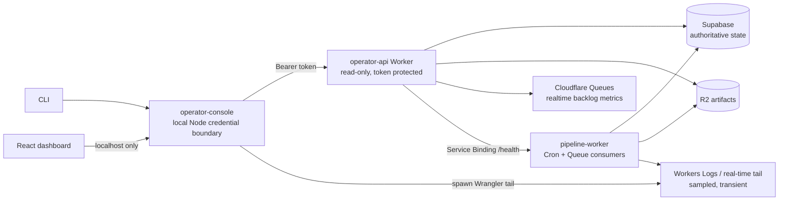

# Implementation Plan: Operator CLI, Dashboard, and Worker Observability

**Date:** 2026-07-17

**Team:** Dot-Gov News Pipeline

**Type:** Full-stack operations tooling and Cloudflare integration

**Status:** Ready to implement in phases. The core inventory, heartbeat, queue, CLI, and dashboard work can begin now. Discovery views depend on the planned `00400` discovery migration; polling views remain capability-gated until polling exists.

## Implementation Checkpoint

The repository currently provides the following foundations:

- `apps/pipeline-worker/` is a deployed Cloudflare Worker with HTTP, Cron, Queue, R2, Supabase, structured console output, generated binding types, Vitest coverage, and deployment validation.
- `apps/inventory-sync/` reconciles the GSA inventory from local or GitHub Actions execution and records durable run history.
- `packages/contracts/` contains the runtime-validated `PipelineEvent` envelope.
- `public.pipeline_events` is durable diagnostic history, while `government_sites`, `site_discovery_state`, and `inventory_sync_runs` are authoritative current state.
- `get_government_inventory_summary`, `list_government_sites`, and discovery claim/recovery RPCs already expose bounded service-role reads and writes.
- The dedicated feed-discovery implementation is planned but not yet present. It owns migration `20260717000400_create_feed_discovery.sql`.
- Feed polling is architected but not implemented. No dashboard should represent polling counts as zero before the polling schema and worker exist.

This plan adds an operator surface without moving scheduling authority out of Supabase or making a browser responsible for Cloudflare credentials.

## Problem Statement

Pipeline state is currently visible only through provider consoles, SQL, Wrangler, logs, and one-off runbook commands. That makes it difficult to verify inventory reconciliation, understand what is due or leased, watch a discovery or polling canary, correlate Worker activity with durable state, and answer common operational questions quickly.

The required operator experience has two complementary forms:

1. A CLI for ad hoc health checks, queue inspection, record lookup, tailing, and automation-friendly JSON output.
2. A locally running dashboard for ambient monitoring and test-run investigation.

Cloudflare continues to run all pipeline processing when the local console is closed. The local process is an observer and credential boundary, not a scheduler, queue consumer, or source of truth.

## Proposed Solution

Build three cooperating layers:

1. A separate read-only `operator-api` Cloudflare Worker that queries bounded Supabase read models, reads R2 metadata, calls the pipeline Worker through a Service Binding, and reads Queue backlog metrics through bindings.
2. A local `operator-console` Node application that contains the CLI, serves the React dashboard, keeps secrets out of the browser, and optionally starts `wrangler tail --format json` for sampled live Worker activity.
3. Shared runtime contracts and a single query-recipe catalog so CLI help, command-palette recipes, copyable dashboard queries, and the Markdown cheatsheet cannot drift.



## Goals

1. Answer “is it healthy?”, “what is queued?”, “what is leased?”, “what changed?”, “what failed?”, and “what is this Worker doing?” from one CLI and dashboard.
2. Keep Supabase scheduling and lease state authoritative.
3. Show Cloudflare queue metrics with source, freshness, and approximation labels.
4. Pair durable state with sampled Worker tail events without treating tail output as proof of execution.
5. Keep all provider credentials and operator tokens outside the browser bundle.
6. Make every dashboard filter reproducible as a read-only CLI command.
7. Support inventory and infrastructure immediately, then light up discovery and polling views through explicit capabilities as those phases land.
8. Preserve the approved National Design Studio-inspired visual system and its accessibility behavior.

## Requirements

1. The Operator API exposes no mutating route.
2. Every `/ops/v1/*` request requires a high-entropy bearer token and returns `Cache-Control: no-store`.
3. The local browser calls only `127.0.0.1`; it never receives `OPS_API_TOKEN`, the Supabase service key, or a Cloudflare API token.
4. `pnpm ops health`, `pnpm ops queues`, `pnpm ops inventory`, `pnpm ops discovery`, `pnpm ops events`, `pnpm ops site`, and `pnpm ops dashboard` are available from the repository root.
5. Every CLI read command supports `--json`; health commands return nonzero when the requested checks fail.
6. Queue panels use `Queue.metrics()` and expose backlog count, backlog bytes, oldest-message time, and observation time.
7. Active-work UI uses durable leases as its primary evidence and displays the last correlated signal separately.
8. Real-time tailing exposes `live`, `sampled`, `reconnecting`, `paused`, and `stale` states.
9. Overview, Inventory, Discovery, Events, and System load independently so one provider outage does not blank the application.
10. Feeds, polling, entries, ranking, and test-run comparison return `not_enabled` with a prerequisite until their durable capabilities exist.
11. CLI examples, dashboard recipes, and `docs/operations/cli-cheatsheet.md` are generated from one catalog and checked in CI.
12. All list APIs are cursor-paginated and enforce maximum limits.
13. Logs and responses never include secrets, remote response bodies, or full URLs containing sensitive query strings.
14. The dashboard passes keyboard, reduced-motion, responsive, and WCAG AA checks defined in the design proposal.

## Non-Goals

- Hosting the dashboard publicly.
- Mutating queue state, retrying jobs, releasing leases, dispatching canaries, or editing inventory from the initial console.
- Replacing Cloudflare or Supabase provider consoles.
- Building a general-purpose raw log warehouse.
- Implementing feed discovery or feed polling inside this workstream.
- Treating Workers real-time logs as durable or complete.
- Creating staging and production environments before the current development canaries justify them.

## Locked Architecture Decisions

### Separate Operator API Worker

Create `apps/operator-api/` instead of expanding the pipeline Worker's public HTTP surface. This keeps read-only operations deployable and testable independently from queue consumers. A Service Binding calls the pipeline Worker's existing `/health` handler without requiring another public hop.

### One local process for CLI and dashboard

`apps/operator-console/` is both the CLI package and the local dashboard server. `pnpm ops dashboard` starts one Node process, serves the built React application, proxies typed API requests, and owns the optional tail subprocess. No local pipeline Worker, queue consumer, Supabase stack, or scheduler is required for hosted monitoring.

### Durable state plus transient tail

- Lease, due time, run, and last-result data come from Supabase.
- Queue pressure comes from Cloudflare Queue bindings.
- Fine-grained current activity comes from a filtered Wrangler tail.
- Tail output can be sampled or disconnected. The UI says so and continues rendering durable state.

### Capability-driven stages

The API returns explicit capabilities such as `inventory`, `discovery`, `feeds`, `polling`, and `ranking`. A missing table, RPC, queue binding, or worker version produces `not_enabled` or `unavailable`; it never produces a fabricated zero.

### Single-user bearer authentication first

Use a generated `OPS_API_TOKEN` stored as a Worker secret and in the ignored local `.env`. Hash both the presented and configured tokens to fixed-length byte arrays before constant-time comparison. Cloudflare Access is a later upgrade when the console becomes multi-user or remotely hosted; it is not required for this single-user localhost workflow.

### Package choices

- Keep the Operator API on an explicit `fetch` router, matching the current pipeline Worker; do not add a Worker web framework for a small read-only route set.
- Use `commander` for the multi-command CLI instead of extending the inventory app's hand-written parser beyond its comfortable scope.
- Use Express only inside the localhost process for API proxying, static assets, Vite middleware in development, and server-sent events.
- Use React, Vite, React Router, and TanStack Query for independent panel queries, URL-restorable state, and partial-provider failures.
- Use Vitest and Testing Library for unit/component coverage, then Playwright with Axe for the critical browser flows.

## Source-of-Truth Matrix

| Question              | Authoritative source                         | Supporting source                 | Honesty rule                                                |
| --------------------- | -------------------------------------------- | --------------------------------- | ----------------------------------------------------------- |
| Is inventory current? | `inventory_sync_runs`                        | R2 artifact `head()`              | A stale or unverifiable artifact is not healthy             |
| What is due?          | `site_discovery_state.next_discovery_at`     | Queue metrics                     | Queue depth is not the durable backlog                      |
| What is processing?   | Active lease columns                         | Fresh structured tail signal      | Say “leased” unless both lease and fresh signal exist       |
| What failed?          | Current state/error columns                  | `pipeline_events` and Worker logs | Bounded state explains current outcome; logs explain detail |
| Is a queue backed up? | `Queue.metrics()`                            | Lease/due age                     | Mark provider metrics with observation time                 |
| Is polling active?    | `feed_fetch_state` plus a polling capability | Poller tail/logs                  | Missing poller is `not_enabled`, never zero                 |

## Shared Contract Changes

Create:

- `packages/contracts/src/operator-api.ts`
- `packages/contracts/src/operator-log.ts`
- `packages/contracts/test/operator-api.test.ts`
- `packages/contracts/test/operator-log.test.ts`

Update:

- `packages/contracts/src/index.ts`
- `packages/contracts/package.json` only if a new direct runtime dependency is required

Define runtime schemas for:

- API response metadata and error envelopes.
- Capability states: `available`, `not_enabled`, `unavailable`, and `stale`.
- Inventory summary, run, site, discovery summary, active lease, event, queue, component-health, and inspector records.
- Cursor tokens and bounded query filters.
- `WorkerLifecycleLogV1`, with `stage`, `action`, `outcome`, `entityType`, bounded IDs, correlation ID, attempt, duration, and occurrence time.

Use a consistent envelope:

```ts
interface OperatorResponse<T> {
  data: T;
  meta: {
    capabilities: Record<string, CapabilityState>;
    environment: string;
    generatedAt: string;
    sources: Array<{
      name: "supabase" | "cloudflare_queue" | "pipeline_worker" | "r2";
      observedAt: string;
      state: "fresh" | "stale" | "unavailable";
    }>;
    warnings: OperatorWarning[];
  };
}
```

Errors use stable machine codes and never echo raw provider errors:

```ts
interface OperatorErrorResponse {
  error: {
    code: string;
    message: string;
    retryable: boolean;
    source?: string;
  };
  meta: { generatedAt: string };
}
```

## Operator API Surface

The Operator API is server-to-server. The local browser does not call it directly.

| Route                                    | Purpose                                          | Initial source                                           |
| ---------------------------------------- | ------------------------------------------------ | -------------------------------------------------------- |
| `GET /ops/v1/capabilities`               | Detect implemented stages and bound providers    | Wrangler bindings plus bounded Supabase capability probe |
| `GET /ops/v1/overview`                   | Pipeline spine counts and freshness              | Existing inventory summary RPC plus capabilities         |
| `GET /ops/v1/inventory/summary`          | Latest run receipt and inventory counts          | Existing RPC plus latest `inventory_sync_runs` rows      |
| `GET /ops/v1/inventory/runs`             | Cursor-paginated run history                     | `inventory_sync_runs`                                    |
| `GET /ops/v1/inventory/sites`            | Bounded site search/list                         | Existing `list_government_sites` RPC                     |
| `GET /ops/v1/discovery/summary`          | Due/leased/outcome/oldest-due state              | `00400`/`00500` RPC when available                       |
| `GET /ops/v1/discovery/active`           | Lease, stage, age, and last signal               | Discovery state/read model when available                |
| `GET /ops/v1/events`                     | Cursor-paginated durable diagnostic events       | `pipeline_events`                                        |
| `GET /ops/v1/sites/:hostname`            | Shared inspector payload                         | Operator site read model when available                  |
| `GET /ops/v1/queues`                     | Main, DLQ, discovery, and polling queue pressure | Bound `Queue.metrics()` calls                            |
| `GET /ops/v1/system/health?depth=<shallow-or-deep>` | Independent component checks                             | Service Binding, Supabase, Queue, and R2 reads           |

Query parameters must be parsed with the shared contracts. Reject unknown parameters and limits outside their declared range.

Shallow health verifies configured bindings and one bounded read per provider. Deep health additionally:

1. Calls the pipeline Worker `/health` through the Service Binding.
2. Reads the latest successful inventory run.
3. Calls `R2.head()` for that run's artifact key.
4. Executes the inventory summary RPC and later the discovery summary RPC.
5. Reads main-queue and DLQ metrics.

Deep health remains read-only; it does not enqueue a synthetic event.

## CLI Surface

The following command grammar is the initial public contract:

```text
pnpm ops health [--deep] [--json]
pnpm ops queues [--json]
pnpm ops inventory summary [--json]
pnpm ops inventory runs [--limit N] [--status STATUS] [--json]
pnpm ops inventory sites [--agency A] [--hostname H] [--all] [--json]
pnpm ops inventory diff [--latest | --from RUN --to RUN] [--json]
pnpm ops discovery summary [--since DURATION] [--json]
pnpm ops discovery active [--stale-after DURATION] [--json]
pnpm ops discovery failures [--since DURATION] [--code CODE] [--json]
pnpm ops events list [--since DURATION] [--type TYPE] [--entity ID] [--json]
pnpm ops events follow [--type TYPE] [--entity ID]
pnpm ops site inspect HOSTNAME [--include-events] [--json]
pnpm ops worker tail [--status STATUS] [--search TEXT]
pnpm ops dashboard [--port PORT] [--no-open]
pnpm ops examples [--json]
pnpm ops docs:generate
```

Default output is concise terminal text with tabular numerals. `--json` prints only the validated response payload and stable metadata; progress and warnings go to stderr. Authentication, network, provider, validation, empty, and not-enabled failures have documented exit codes.

## Database Read Models

### Core phase: no migration dependency

The first release can use existing service-role reads and RPCs:

- `get_government_inventory_summary()`
- `list_government_sites(...)`
- bounded selects on `inventory_sync_runs`
- bounded cursor selects on `pipeline_events`

This allows inventory, heartbeat, event history, and system health work to proceed in parallel with discovery.

### Post-discovery phase

After `20260717000400_create_feed_discovery.sql` lands, create:

- `supabase/migrations/20260717000500_create_operator_read_models.sql`
- `supabase/tests/database/operator_read_models.test.sql`

Add stable, service-only, `SECURITY DEFINER` RPCs with `search_path = ''`, fully qualified relations, bounded arguments, explicit revoke/grant statements, and no direct grants to `anon` or `authenticated`:

- `get_operator_discovery_summary(p_since timestamptz)`
- `list_operator_active_discoveries(p_after_started_at timestamptz, p_after_site_id uuid, p_limit integer)`
- `list_operator_discovery_failures(p_since timestamptz, p_error_code text, p_limit integer)`
- `get_operator_site_inspector(p_hostname text)`
- `get_operator_feed_summary()`

Add `pipeline_events_occurred_id_idx` on `(occurred_at, id)` if query analysis shows the existing indexes do not support the cursor scan.

Do not create a second backlog table. Read models aggregate authoritative inventory, lease, feed, and polling tables.

### Polling integration contract

The future polling migration owns its scheduler and state changes. It must expose or support:

- active feed leases;
- current stage and last-signal time;
- last HTTP result, `304` state, duration, and bytes;
- next-fetch time and backoff;
- new-entry count and last-new-item time.

When those fields and the polling Queue binding exist, the Operator API advertises `polling: available` and the existing pipeline spine lights up without changing the console architecture.

## Implementation Steps

### 1. Freeze the operator contracts and repository boundaries

**Complexity:** Small

**Dependencies:** None

Create/update:

- `packages/contracts/src/operator-api.ts`
- `packages/contracts/src/operator-log.ts`
- `packages/contracts/src/index.ts`
- `packages/contracts/test/operator-api.test.ts`
- `packages/contracts/test/operator-log.test.ts`
- `package.json`

Add the schemas described above, root `ops` script, and contract tests for valid, malformed, oversized, unknown-version, invalid-cursor, partial-source, and not-enabled payloads.

**Deliverable:** Worker, local server, CLI, and browser share one runtime-validated protocol.

### 2. Scaffold the read-only Operator API Worker

**Complexity:** Medium

**Dependencies:** Step 1

Create:

- `apps/operator-api/package.json`
- `apps/operator-api/tsconfig.json`
- `apps/operator-api/vitest.config.ts`
- `apps/operator-api/wrangler.jsonc`
- `apps/operator-api/.dev.vars.example`
- `apps/operator-api/worker-configuration.d.ts` through `wrangler types`; never hand-edit it
- `apps/operator-api/src/index.ts`
- `apps/operator-api/src/env.ts`
- `apps/operator-api/src/router.ts`
- `apps/operator-api/src/auth/authorize-operator.ts`
- `apps/operator-api/src/http/operator-response.ts`
- `apps/operator-api/src/clients/operator-supabase.ts`
- `apps/operator-api/src/handlers/capabilities.ts`
- `apps/operator-api/src/handlers/overview.ts`
- `apps/operator-api/src/handlers/inventory.ts`
- `apps/operator-api/src/handlers/events.ts`
- `apps/operator-api/src/handlers/queues.ts`
- `apps/operator-api/src/handlers/system-health.ts`
- `apps/operator-api/test/auth.test.ts`
- `apps/operator-api/test/routes.test.ts`
- `apps/operator-api/test/queues.test.ts`
- `pnpm-lock.yaml`

Configure:

- `SUPABASE_URL` variable and `SUPABASE_SECRET_KEY` secret.
- `OPS_API_TOKEN` secret and `OPS_API_ENABLED` variable.
- R2 `ARTIFACTS` binding.
- Main Queue and DLQ producer bindings for metrics.
- A `PIPELINE_WORKER` Service Binding to `dot-gov-news-pipeline-dev`.
- Observability enabled, `workers_dev: true`, and preview URLs disabled.

The router permits only `GET` and `HEAD`; any other method returns `405`. Unknown routes return `404`. Protected responses use `no-store`, `nosniff`, and a restrictive content-security policy even though the API returns JSON.

Add `check:types`, `check:deploy`, `deploy`, `test`, and `typecheck` scripts following `apps/pipeline-worker/package.json`.

**Deliverable:** A deployable, token-protected, read-only Worker serves core inventory, event, queue, capability, and health data.

### 3. Implement the typed Operator API client and CLI foundation

**Complexity:** Medium

**Dependencies:** Steps 1 and 2

Create:

- `apps/operator-console/package.json`
- `apps/operator-console/tsconfig.json`
- `apps/operator-console/vitest.config.ts`
- `apps/operator-console/src/config.ts`
- `apps/operator-console/src/api/operator-client.ts`
- `apps/operator-console/src/api/operator-error.ts`
- `apps/operator-console/src/cli/main.ts`
- `apps/operator-console/src/cli/output.ts`
- `apps/operator-console/src/cli/exit-codes.ts`
- `apps/operator-console/src/cli/commands/health.ts`
- `apps/operator-console/src/cli/commands/queues.ts`
- `apps/operator-console/src/cli/commands/inventory.ts`
- `apps/operator-console/src/cli/commands/discovery.ts`
- `apps/operator-console/src/cli/commands/events.ts`
- `apps/operator-console/src/cli/commands/site.ts`
- `apps/operator-console/test/operator-client.test.ts`
- `apps/operator-console/test/cli.test.ts`
- `.env.example`
- `pnpm-lock.yaml`

Use Node 24 and `process.loadEnvFile()` like `apps/inventory-sync`. Required local values are `OPS_API_URL` and `OPS_API_TOKEN`; optional values include environment name and timeout. Refuse to start if the API URL is not HTTPS unless it is loopback.

Implement abortable requests, bounded retries for idempotent reads, response-schema validation, JSON output, human output, stderr warnings, and stable exit codes.

**Deliverable:** Core health, queue, inventory, event, and site commands work before any dashboard code exists.

### 4. Create the single query and recipe catalog

**Complexity:** Medium

**Dependencies:** Step 3

Create:

- `apps/operator-console/src/catalog/operator-recipes.ts`
- `apps/operator-console/src/catalog/render-cli-command.ts`
- `apps/operator-console/src/catalog/render-cheatsheet.ts`
- `apps/operator-console/test/operator-recipes.test.ts`
- `docs/operations/cli-cheatsheet.md` as generated output

Each recipe declares:

- stable ID and user-facing question;
- CLI command and safe default flags;
- dashboard route and serialized filter state;
- required capability;
- expected output mode and failure guidance.

Generation must be deterministic. CI runs the generator and fails if the checked-in cheatsheet differs.

Initial questions include:

- Is everything alive?
- What is queued or leased?
- What failed in the last 30 minutes?
- What changed in the latest inventory sync?
- Why is this hostname stuck?
- What is the Worker processing now?
- Is feed polling enabled, and what is it doing?

**Deliverable:** CLI help, command palette, copy-query actions, and cheatsheet share one source.

### 5. Normalize Worker lifecycle logs and add the live-tail adapter

**Complexity:** Medium

**Dependencies:** Steps 1 and 3

Create:

- `apps/pipeline-worker/src/observability/worker-log.ts`
- `apps/pipeline-worker/test/worker-log.test.ts`
- `apps/operator-console/src/tail/start-worker-tail.ts`
- `apps/operator-console/src/tail/parse-tail-event.ts`
- `apps/operator-console/src/tail/tail-state.ts`
- `apps/operator-console/test/tail-parser.test.ts`

Update:

- `apps/pipeline-worker/src/handlers/queue.ts`
- `apps/pipeline-worker/src/handlers/scheduled.ts`
- future discovery and polling handlers as they land

Change `console.log(JSON.stringify(...))` to bounded structured objects validated by `WorkerLifecycleLogV1`. Include correlation IDs, entity IDs, stage, action, outcome, attempts, and duration where available; omit bodies, secrets, and sensitive query strings.

The local adapter starts:

```sh
pnpm --filter @dot-gov-news/pipeline-worker exec wrangler tail --format json
```

Parse line-delimited trace objects, normalize lifecycle logs, expose sampling warnings, restart with capped exponential backoff, and terminate the child on dashboard shutdown. `events follow` and `worker tail` use the same adapter.

**Deliverable:** The CLI can show live Worker activity with explicit sampled/reconnecting/stale state while durable commands continue working independently.

### 6. Build the local server and browser credential boundary

**Complexity:** Medium

**Dependencies:** Steps 3–5

Create:

- `apps/operator-console/src/server/index.ts`
- `apps/operator-console/src/server/create-server.ts`
- `apps/operator-console/src/server/api-routes.ts`
- `apps/operator-console/src/server/event-stream.ts`
- `apps/operator-console/src/server/security.ts`
- `apps/operator-console/test/server.test.ts`
- `apps/operator-console/vite.config.ts`
- `apps/operator-console/index.html`

The server binds to `127.0.0.1` by default. It injects the Operator API token server-side, validates all upstream responses, and exposes only same-origin `/api/*` routes to the browser. Reject non-loopback binding unless the user opts in explicitly and supplies a local access token.

`/api/events/stream` uses server-sent events to merge:

- cursor-polled durable `pipeline_events`;
- normalized Wrangler tail lifecycle logs;
- tail connection/sampling state.

The merge deduplicates by event/correlation identity and never rewrites a durable state record based on a tail event.

**Deliverable:** `pnpm ops dashboard` starts one localhost process and opens the browser without exposing credentials.

### 7. Implement the NDS-inspired application shell and shared states

**Complexity:** Large

**Dependencies:** Step 6

Create:

- `apps/operator-console/src/ui/main.tsx`
- `apps/operator-console/src/ui/App.tsx`
- `apps/operator-console/src/ui/router.tsx`
- `apps/operator-console/src/ui/api/local-client.ts`
- `apps/operator-console/src/ui/state/query-state.ts`
- `apps/operator-console/src/ui/components/AppHeader.tsx`
- `apps/operator-console/src/ui/components/PrimaryNav.tsx`
- `apps/operator-console/src/ui/components/CommandPalette.tsx`
- `apps/operator-console/src/ui/components/SourceState.tsx`
- `apps/operator-console/src/ui/components/NotEnabled.tsx`
- `apps/operator-console/src/ui/components/PanelError.tsx`
- `apps/operator-console/src/ui/components/Inspector.tsx`
- `apps/operator-console/src/ui/styles/tokens.css`
- `apps/operator-console/src/ui/styles/base.css`
- `apps/operator-console/src/ui/styles/layout.css`
- `apps/operator-console/src/ui/styles/components.css`

Translate, rather than iframe or embed, the approved standalone dashboard artifact. Preserve the monochrome canvas, top navigation, asymmetric heading, Roman-numbered sections, thin rules, status-only colors, dark/light themes, and compact data typography. The artifact was removed after implementation; `apps/operator-console` is now authoritative.

Implement shared loading, stale, disconnected, partial-failure, empty, and not-enabled states before view-specific happy paths. Serialize environment, run, time range, filters, and inspector entity in the URL.

**Deliverable:** A keyboard-operable shell renders every data-honesty state consistently.

### 8. Implement Overview, System, and Events views

**Complexity:** Large

**Dependencies:** Steps 2, 5–7

Create:

- `apps/operator-console/src/ui/routes/OverviewRoute.tsx`
- `apps/operator-console/src/ui/routes/SystemRoute.tsx`
- `apps/operator-console/src/ui/routes/EventsRoute.tsx`
- `apps/operator-console/src/ui/components/PipelineSpine.tsx`
- `apps/operator-console/src/ui/components/ActiveWorkTable.tsx`
- `apps/operator-console/src/ui/components/QueuePressure.tsx`
- `apps/operator-console/src/ui/components/ComponentHealth.tsx`
- `apps/operator-console/src/ui/components/ActivityLedger.tsx`
- `apps/operator-console/src/ui/components/HealthCheckResult.tsx`

Load panels independently. The pipeline spine reads capabilities; current inventory/heartbeat data renders immediately while later stages say `Not enabled`. Queue metrics show `~` and observation time. Activity following pauses when the user scrolls away from the live edge and offers a “new events” affordance.

System health shows every check independently. Deep-check failure must not flatten successful checks into a single generic error.

**Deliverable:** The primary monitoring loop is usable against today's infrastructure and automatically gains discovery/polling data when capabilities appear.

### 9. Implement the Inventory view and run-level diff

**Complexity:** Medium

**Dependencies:** Steps 2, 3, and 7

Create:

- `apps/operator-console/src/ui/routes/InventoryRoute.tsx`
- `apps/operator-console/src/ui/components/InventoryReceipt.tsx`
- `apps/operator-console/src/ui/components/InventoryRunTable.tsx`
- `apps/operator-console/src/ui/components/SiteTable.tsx`

Display source timestamp, ETag, checksum, artifact verification, row counts, inserted/updated/reactivated/deactivated/eligible counts, duration, and previous-run comparison. Initial diff is run-level because the current schema does not retain a per-site before-image.

If agency-level or field-level historical diffs become required, add a separately reviewed inventory-change audit table during inventory reconciliation; do not reconstruct false historical precision from current rows.

**Deliverable:** An operator can verify the latest sync, compare it with the previous run, inspect sites, and copy the matching CLI query.

### 10. Add discovery read models and the Discovery view after `00400`

**Complexity:** Large

**Dependencies:** Discovery migration and Worker steps, plus Steps 2 and 7

Create:

- `supabase/migrations/20260717000500_create_operator_read_models.sql`
- `supabase/tests/database/operator_read_models.test.sql`
- `apps/operator-api/src/handlers/discovery.ts`
- `apps/operator-api/src/handlers/site-inspector.ts`
- `apps/operator-console/src/ui/routes/DiscoveryRoute.tsx`
- `apps/operator-console/src/ui/components/DiscoveryFunnel.tsx`
- `apps/operator-console/src/ui/components/DiscoveryOutcomeChart.tsx`
- `apps/operator-console/src/ui/components/SiteInspector.tsx`

Implement the RPCs in **Database Read Models**. Extend discovery orchestration to emit bounded lifecycle logs at claim, fetch, parse, candidate validation, complete, fail, and retry boundaries. The active-work query joins leases to the latest correlated signal but never lets a signal override lease truth.

Database tests cover grants, pagination, oldest-due calculation, expired leases, no-feed versus failure counts, stale signals, hostname normalization, and missing capabilities.

**Deliverable:** Discovery canaries are visible from claim through durable outcome, with inspectable failures and feed provenance.

### 11. Add feed and polling observability adapters when polling exists

**Complexity:** Medium after the polling schema; blocked before it

**Dependencies:** Feed-discovery `00400`, polling schema/worker, and Steps 2 and 7

Update/create:

- `packages/contracts/src/operator-api.ts`
- `packages/contracts/src/operator-log.ts`
- `apps/operator-api/src/handlers/feeds.ts`
- `apps/operator-api/src/handlers/polling.ts`
- `apps/operator-console/src/ui/routes/FeedsRoute.tsx`
- `apps/operator-console/src/ui/components/PollingActiveWork.tsx`
- the polling migration's service-only operator read RPCs

Expose due, leased, active, backoff, last success, `304`, parse failure, bytes, latency, and new-entry counts. At polling scale, persist current/last state in `feed_fetch_state`; do not write every successful poll as a permanent `pipeline_events` row. Use structured Workers Logs for fine-grained live detail and durable events for failures, state changes, or new entries.

**Deliverable:** The dashboard answers what feed pollers are processing without turning diagnostic history into a high-volume scheduler table.

### 12. Add component, integration, E2E, and hosted verification

**Complexity:** Large

**Dependencies:** All implemented phases

Create/update:

- `apps/operator-console/test/ui/`
- `apps/operator-console/e2e/operator-dashboard.spec.ts`
- `apps/operator-console/playwright.config.ts`
- `.github/workflows/ci.yml`
- `docs/infrastructure/runbook.md`
- `architecture.md`
- `docs/infrastructure/access.md`
- `docs/infrastructure/teardown.md`

Add Playwright and Axe coverage for critical flows and responsive states. CI installs the required browser only for the operator-console job. Add an Operator API dry-run deployment check and generated-cheatsheet drift check.

Hosted verification:

1. Deploy `operator-api` with `OPS_API_ENABLED=false`.
2. Set `SUPABASE_SECRET_KEY` and a generated `OPS_API_TOKEN` through Wrangler secrets.
3. Verify unauthenticated, wrong-token, wrong-method, and unknown-route responses.
4. Enable the API and verify capabilities, inventory summary, main queue, DLQ, shallow health, and deep health.
5. Run the CLI in human and JSON modes.
6. Start the dashboard, verify no secret appears in HTML, JavaScript, network responses, logs, or browser storage.
7. Start a filtered tail and trigger one heartbeat; confirm live activity, sampling status, and durable event correlation.
8. Repeat the 25-site and 250-site discovery canary checks when discovery is available.
9. Record deployment version, endpoint, secret rotation procedure, and known not-enabled capabilities in the runbook.

**Deliverable:** The complete observer path is tested locally and against hosted development infrastructure without mutating pipeline state.

## Testing Strategy

### Contract tests

- Every response and error schema.
- Cursor encoding/decoding and invalid cursors.
- Capability and partial-source states.
- Worker lifecycle log size, enum, timestamp, and secret-field rejection.

### Operator API Worker tests

- Missing, malformed, wrong, and correct bearer tokens.
- Constant-length token comparison path.
- Method and route allowlists.
- Query limit enforcement and provider error sanitization.
- Queue metrics success, unavailable binding, and provider failure.
- Shallow/deep health partial failures.
- Service Binding and R2 verification mocks.
- No mutating call on any route.

### Database tests

- Service-role-only grants and anonymous denial.
- Bounded cursor pagination with stable ordering.
- Due/leased/expired/backoff/no-feed aggregates.
- Active-work lease and signal freshness classification.
- Site inspector identity and provenance.
- Capability behavior when discovery or polling objects are absent.

### CLI and local-server tests

- Config loading without secret echoing.
- Human output and exact JSON output.
- Exit codes for healthy, degraded, unavailable, unauthenticated, invalid, and not-enabled cases.
- Retry/timeout behavior for idempotent reads.
- Wrangler tail parsing, sampling warnings, restart/backoff, and shutdown.
- SSE deduplication, ordering, and backpressure.
- Loopback-only binding and local security headers.

### React component tests

- Loading, stale, partial-failure, empty, and not-enabled states for every panel.
- Lease versus last-signal wording.
- Command-palette and CLI-copy parity.
- URL serialization and inspector restoration.
- Follow-live pause/resume without focus or scroll theft.
- Theme, compact mode, keyboard shortcuts, and reduced motion.

### E2E tests

1. Overview loads when tail is unavailable.
2. One provider panel fails without blanking other panels.
3. A user opens an active lease, inspects its timeline, and copies the exact CLI query.
4. Health and deep health report independent check results.
5. Command palette navigation produces the expected route and command.
6. Event following pauses after manual scroll and resumes explicitly.
7. Discovery and polling display `Not enabled` before their capabilities exist.
8. Desktop, compact, and 390px layouts have no body overflow; wide data regions scroll intentionally.
9. Axe reports no serious or critical violations in dark and light themes.

## Rollout Plan

### Phase A: Core observer

1. Contracts.
2. Operator API with existing inventory/event/queue/health reads.
3. CLI and generated cheatsheet.
4. Local server and dashboard shell.
5. Overview, Inventory, Events, and System.
6. Hosted development smoke test.

This phase does not wait for discovery.

### Phase B: Discovery canary visibility

1. Merge/apply discovery `00400`.
2. Add operator read-model `00500`.
3. Bind discovery Queue and DLQ to the Operator API.
4. Add lifecycle logs and Discovery/Inspector views.
5. Use the console during 25-site and 250-site canaries.

### Phase C: Polling visibility

1. Implement and benchmark polling independently.
2. Add polling state and queue capabilities.
3. Add polling API/CLI/UI adapters.
4. Verify high-volume log and event-retention behavior before enabling the full corpus.

## Pause and Rollback

- Set `OPS_API_ENABLED=false` and deploy to disable all protected reads without touching pipeline processing.
- Rotate or delete `OPS_API_TOKEN` to revoke local access.
- Stop the local dashboard or tail process; pipeline Cron and Queue consumers continue normally.
- Roll back Operator API and console code independently from the pipeline Worker.
- Retain additive service-only read RPCs during rollback; unused read models do not mutate state.
- Remove Queue bindings only after the API no longer references them.
- Never roll back by deleting inventory, discovery, feed, polling, or event data.

## Acceptance Criteria

- `pnpm ops health --deep` reports each component independently and exits nonzero on requested-check failure.
- `pnpm ops queues --json` returns validated realtime metrics for every bound queue with observation timestamps.
- `pnpm ops inventory summary` matches the hosted inventory receipt and latest R2 artifact.
- `pnpm ops dashboard` starts one localhost process; no local pipeline Worker or scheduler is needed.
- Browser code and storage contain no provider or Operator API credentials.
- The overview renders inventory and infrastructure today and truthful not-enabled states for future stages.
- Active discovery and polling rows use leases as truth and show last signals separately.
- Sampled or disconnected Worker tailing is visible and never changes durable health/state labels.
- Every dashboard query can be copied as a valid read-only CLI command generated from the shared catalog.
- The CLI cheatsheet is generated and CI detects drift.
- One panel/provider failure does not blank unrelated panels.
- The dashboard passes defined keyboard, theme, responsive, reduced-motion, and automated accessibility checks.
- Discovery 25-site and 250-site canaries can be monitored from claim through outcome once discovery is enabled.
- Polling activity appears only after a polling capability exists and includes current leases, queue pressure, and outcomes.

## Risks and Mitigations

| Risk                                              | Mitigation                                                                                                                          |
| ------------------------------------------------- | ----------------------------------------------------------------------------------------------------------------------------------- |
| Public workers.dev endpoint is probed             | High-entropy secret, fixed-length comparison, no-store responses, read-only routes, rotation runbook, optional future Access policy |
| Browser credential leakage                        | Browser talks only to loopback BFF; secrets stay in Node environment                                                                |
| Real-time logs are sampled                        | Display tail state; use durable leases and records for truth; filter Wrangler tail aggressively                                     |
| Queue metrics are unavailable or lag              | Show provider observation time and scoped unavailable state; never replace durable due counts                                       |
| API and dashboard drift                           | Shared Zod contracts and contract tests                                                                                             |
| CLI and cheatsheet drift                          | Single recipe catalog plus deterministic generation check                                                                           |
| Operator query overloads Supabase                 | Service-only bounded RPCs, cursor pagination, limits, indexes, independent panel cadence                                            |
| Diagnostic events grow too quickly during polling | Persist current polling state; reserve durable events for failures/transitions/new entries; use Workers Logs for fine detail        |
| Discovery lands after the console                 | Capabilities and core reads require no `00400`; Discovery remains not enabled                                                       |
| Operator Worker deployment affects processing     | Separate Worker and deployment; Service Binding is read-only health access                                                          |

## Open Questions and Locked Defaults

Implementation can proceed with these defaults:

- **Operator API authentication:** high-entropy bearer token for the single-user development environment; revisit Cloudflare Access for multi-user/remote use.
- **Local port:** choose an available loopback port beginning at `4173`; allow `--port` override.
- **Dashboard refresh:** inventory 60 seconds, health/queues 10 seconds, active work 3 seconds, durable events 2 seconds; suspend background refresh when the tab is hidden except for active canary mode.
- **Tail filters:** default to the pipeline Worker name and structured lifecycle marker; do not request an unfiltered account-wide tail.
- **Durable event retention:** do not add automatic deletion in this plan. Measure growth during discovery canaries and define retention before full polling.
- **Inventory diff detail:** run-level counts now; add per-site change audit only through a separately reviewed reconciliation change.
- **Mutation controls:** excluded until a dedicated audited and confirmed command design is approved.

## References

- [Operator dashboard design proposal](../../docs/superpowers/specs/2026-07-17-operator-dashboard-nds-design.md)
- Historical standalone dashboard preview (removed after implementation)
- [Pipeline architecture](../../architecture.md)
- [Cloudflare site feed discovery plan](cloudflare-site-feed-discovery-implementation-plan.md)
- [Infrastructure runbook](../../docs/infrastructure/runbook.md)
- [Cloudflare Queue realtime metrics](https://developers.cloudflare.com/changelog/post/2026-04-28-improved-queues-metrics/)
- [Cloudflare Workers real-time logs](https://developers.cloudflare.com/workers/observability/logs/real-time-logs/)
- [Cloudflare Workers structured logs](https://developers.cloudflare.com/workers/observability/logs/workers-logs/)
- [Cloudflare Service Bindings](https://developers.cloudflare.com/workers/runtime-apis/bindings/service-bindings/)
- [Wrangler tail command](https://developers.cloudflare.com/workers/wrangler/commands/workers/#tail)
