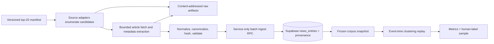

# Implementation Plan: Top-20 Government News Backfill

**Date:** 2026-07-18
**Team:** Dot-Gov News Pipeline
**Type:** Data acquisition, database ingestion, and clustering-evaluation enablement
**Status:** Proposed

## Outcome

Build a resumable historical collector that loads a reviewed, diverse cohort of
20 government publishers into `public.news_entries`, with a fixed 12-month
target window and a six-month minimum coverage floor. Preserve raw retrieval
evidence, source/run provenance, and publication time so the clustering
pipeline can replay the corpus in event-time order and produce reproducible
evaluations.

The first reproducible evaluation window is frozen at:

- Target: `2025-07-18T00:00:00Z` through `2026-07-18T00:00:00Z`.
- Minimum acceptable publisher coverage: `2026-01-18T00:00:00Z` through
  `2026-07-18T00:00:00Z`.
- Later refreshes use a new manifest/run version rather than moving these dates
  underneath the initial benchmark.

## Critical Current-State Finding

The backfill cannot start against hosted Supabase yet. Hosted migrations stop
at `20260718000300`; local migrations
`20260718000400_create_news_entries.sql` through
`20260718000800_create_rubric_weights.sql` have not been applied remotely.
Consequently, hosted PostgREST currently returns `404` for `news_entries`.

Applying `00400` is necessary but not sufficient: `service_role` deliberately
has `SELECT` only on `news_entries`, and no write RPC exists. The rollout must
therefore pass two gates before publisher crawling begins:

1. Apply and verify migrations `00400`–`00800` on hosted Supabase.
2. Add service-only, security-definer registration, backfill-lifecycle, and
   bounded ingest RPCs; do not grant generic table inserts.

The existing generalized discovery Worker is also not a dependency for this
backfill. Its repository client still sends retired feed-specific fields
(`p_feeds`, `feed_type`, `no_feed`) while the hosted RPC expects generalized
source fields. Keep `DISCOVERY_ENABLED=false` until that drift is fixed in a
separate change.

## Cohort Decision

The recommended candidate is a **curated top-20 evaluation cohort**, not an
unreviewed query of the first 20 traffic rows. Traffic establishes relevance;
clustering also needs topic, format, cadence, and publisher diversity. The
candidate substitutes SEC and BLS for literal-traffic members CBP and
CMS/Medicare, adding securities and economic/labor coverage. Task 1 requires
explicit cohort approval before the manifest is named and frozen. If strict
traffic order is chosen, CBP and CMS/Medicare replace SEC and BLS without code
changes; the two cohorts must have distinct IDs and cannot both be called
`top-20-v1`.

Traffic figures below come from the supplied
`Top 100000 Domains Last 30 Days.csv` dataset and are stored in the manifest as
cohort-selection evidence, not used as ranking weights.

| # | Publisher | 30-day visits | Historical acquisition plan | Registry status / exclusions |
| ---: | --- | ---: | --- | --- |
| 1 | USPS | 409,766,643 | Primary About USPS RSS; secondary USPS News feed/archive | Deep RSS observed (668 items to 2021); exclude comment feeds |
| 2 | NCBI | 310,364,315 | NCBI Insights WordPress REST/archive; article metadata fallback | Current feed is only about 10 items; exclude comment/about noise |
| 3 | National Weather Service | 113,029,034 | News/archive HTML, then sitemap; RSS only as a current supplement | Exclude local forecast, alert, and ocean-product streams from the news corpus |
| 4 | USCIS | 49,972,576 | All News RSS; HTML archive fallback | RSS observed at 250 items and reaches 2024 |
| 5 | Veterans Affairs | 49,063,770 | WordPress REST/archive; current RSS supplement | RSS is shallow; exclude comments, research datasets, and non-news catalogs |
| 6 | Social Security | 49,021,309 | Yearly press-release archive HTML | Registry only has SSA OIG, which is not a substitute for primary SSA news |
| 7 | IRS | 47,561,491 | Year-indexed news-release archive HTML | Existing registered feeds are Taxpayer Advocate/localized feeds, not primary IRS newsroom |
| 8 | NASA | 46,465,719 | WordPress REST posts/archive; main NASA feed supplement | Registry has many subproject/comment feeds; curate one primary newsroom path |
| 9 | NOAA | 31,957,053 | Paginated NOAA news HTML; sitemap fallback | Registry is noisy with subprojects, comments, and operational products |
| 10 | Department of Justice | 28,397,575 | Paginated `/news` archive; RSS for current tail | No registered primary source; RSS alone is shallow (about 25 items) |
| 11 | Federal Student Aid | 26,766,499 | FSA Partners “What’s New” HTML listing | Hidden RSS is malformed/outdated; reject it as historical authority |
| 12 | CDC | 25,560,037 | Press-release/newsroom HTML archive; syndication API only after URL mapping is validated | Existing registry rows are datasets/services, not the primary newsroom |
| 13 | Department of State | 24,779,567 | Press-release HTML archive | Keep travel-advisory RSS as an explicitly labeled subtype, not a press-release substitute |
| 14 | USGS | 22,531,455 | `/news/all/feed`; archive/sitemap fallback | Strong registered primary feed exists |
| 15 | National Park Service | 20,768,640 | Official `newsreleases` publisher API | Requires API key; current registered XML is unrelated permit data |
| 16 | Treasury | 14,883,463 | Press-release HTML archive/sitemap | No registered primary source |
| 17 | FDA | 14,281,197 | Press-announcement HTML archive/sitemap | No registered primary source |
| 18 | USDA | 14,169,055 | Press-release HTML archive/sitemap | Existing sources are mostly data/ARS, not primary press |
| 19 | SEC | 11,422,466 | Press-release RSS plus paginated archive | Added for securities/regulatory diversity; no registered source today |
| 20 | BLS | 6,059,243 | Latest-releases RSS plus release archive | Added for economic/labor diversity; useful registered RSS exists |

Before implementation marks any endpoint as production-ready, the adapter
spike must verify its exact URL, response shape, pagination, publication-time
semantics, and archive depth. The table describes the expected strategy, not a
promise that an untested selector will remain stable.

## Architecture

The collector is a long-running Node/TypeScript command, not a Cloudflare Queue
consumer. Deep archives require publisher-specific pagination, resumable local
state, controlled pacing, and more requests than the current discovery Worker
budget is designed to support.



Collection has two explicit stages:

1. **Enumerate** listing/feed/API/sitemap pages into candidate items containing
   an external ID when available, URL, title, publication time, summary, and
   listing-artifact reference.
2. **Hydrate** only candidates missing required fields by fetching the article
   page and extracting canonical URL, publication time, title, and a bounded
   summary/body excerpt.

Adapter preference is publisher API, genuinely historical syndication feed,
news sitemap, paginated HTML archive, then article-page hydration. A source may
combine adapters—for example, an archive for history and RSS for the current
tail—but every candidate converges on one normalized contract.

## Data Contracts and Persistence

### Versioned cohort manifest

Create the recommended candidate as
`config/news-backfill/top-20-diversity-v1.json`, validated by a discriminated
Zod schema. If strict traffic ordering is approved instead, create
`config/news-backfill/top-20-traffic-v1.json`. The chosen manifest contains
exactly 20 publisher records with:

- Stable `publisherKey`, agency/site name, government-site ID, base domain,
  traffic evidence, and inclusion rationale.
- Fixed `windowStart`, `minimumStart`, and `windowEnd`.
- One or more ordered acquisition sources with source type, adapter version,
  endpoint, pagination/date-stop behavior, and expected archive depth.
- Per-host rate and concurrency limits.
- Allowed article hosts and path patterns, plus excluded paths/content classes.
- Adapter configuration such as JSON field paths or bounded CSS selectors.
- Expected newsroom subtype (`press_release`, `agency_news`, `advisory`, or
  `release`) so operational feeds are not mixed accidentally.

Hash the normalized manifest bytes with SHA-256. Every run records that hash;
mutating a checked-in v1 manifest after data is loaded is forbidden—create v2.

### Normalized item

Add `packages/contracts/src/news-backfill.ts` with a strict normalized item:

```ts
type NormalizedNewsItem = {
  publisherKey: string;
  newsSourceId: string;
  newsSubtype: "press_release" | "agency_news" | "advisory" | "release";
  externalItemId: string | null;
  url: string;
  urlCanonical: string;
  title: string;
  summary: string | null;
  publishedAt: string;
  fetchedAt: string;
  contentHash: string;
  extractorVersion: number;
  rawArtifactKey: string;
};
```

Canonicalization removes fragments, default ports, known tracking parameters,
and publisher-approved cosmetic query parameters; it must not collapse distinct
documents. `contentHash` is SHA-256 of normalized title, a newline, and
normalized summary/body excerpt. Preserve different URLs with the same content
hash because those pairs are useful cross-publisher duplicate evidence for
threshold calibration.

### Backfill control and provenance

This backfill is the prerequisite, so it owns the next migrations:

- `supabase/migrations/20260718000900_create_news_backfill_control.sql`
- `supabase/migrations/20260718001000_create_news_backfill_rpcs.sql`

Task 0 must first revise the unimplemented clustering plan: renumber its
`compute_rank_key` migration to `20260718001100`, renumber its clustering-write
RPC migration to `20260718001200`, and remove its duplicate ownership of
`ingest_news_entry`. The backfill RPC migration owns the generic ingest
function and returns both the existing/new entry ID and its disposition. These
numbers are a locked decision; do not defer renumbering until deployment. The
control migration creates:

- `news_backfill_runs`: manifest/cohort version and hash, fixed window, status,
  aggregate counters, timestamps, and bounded terminal error.
- `news_backfill_targets`: one row per manifest acquisition target with run,
  site/source/adapter identity, durable cursor, lease token/owner/expiry,
  counters, oldest/newest accepted date, coverage status, and bounded last
  error. Coverage is proven by traversal, not inferred from the oldest accepted
  item: record `coverage_reached_at`, `stop_reason`, and a
  `coverage_evidence_artifact_key` showing that the adapter crossed the window
  boundary or exhausted the authoritative archive.
- `news_entry_origins`: persistent entry/source provenance and source-scoped
  external item ID plus news subtype. Add a partial unique index on
  `(news_source_id, external_item_id)` when the ID is non-null.
- `news_backfill_run_entries`: exact run/source-target corpus membership,
  ingest disposition, raw artifact key, extractor version, and observation
  time. A completed rerun records its membership without duplicating the
  canonical entry or persistent origin.
- `news_backfill_identity_conflicts`: quarantined cases where a candidate's
  canonical URL resolves to one entry but its source/external ID resolves to a
  different entry. Store both IDs and evidence; never merge or pick one
  implicitly.

The migration also changes the `news_entries.news_source_id` foreign key from
`on delete cascade` to `on delete restrict`. A canonical entry can have several
origins and must not disappear when its first-observed source is removed.
Coverage and attribution queries use `news_entry_origins`, not only the legacy
owner column.

Keep `news_entries.url_canonical` globally unique. The first accepted source
owns `news_entries.news_source_id`; later observations of the same canonical
URL add an origin row instead of losing provenance or creating a duplicate
entry. Do not put raw HTML/XML in Postgres.

All operational tables remain RLS-protected. `service_role` receives only the
required `SELECT` grants and `EXECUTE` on these security-definer RPCs:

- `register_curated_news_source(...)`: upsert reviewed source metadata, manual
  site provenance, `adapter_config`, quality flags, and backfill availability.
- `begin_news_backfill_run(...)`: atomically create the run and its validated
  target set from bounded JSON.
- `claim_news_backfill_targets(...)`: lease due targets with `skip locked`.
- `checkpoint_news_backfill_target(...)`: token-checked cursor/counter update.
- `complete_news_backfill_target(...)` and
  `fail_news_backfill_target(...)`: token-checked terminal/backoff transitions.
- `recover_expired_news_backfill_targets(...)`: make interrupted work claimable.
- `ingest_news_entries(p_target_id, p_lease_token, p_entries jsonb)`: accept at
  most 100 prevalidated items, call the generic `ingest_news_entry`, and return
  one disposition per input (`inserted`, `existing_url`, or
  `existing_external_id`; `identity_conflict` is quarantined and returned as a
  rejected disposition). It upserts persistent origins and exact run
  membership for every accepted observation and never grants direct table
  writes.
- `finish_news_backfill_run(...)`: succeeds only when every target is terminal.

Every function uses `security definer`, `set search_path = ''`, fully qualified
relations, bounded arguments, revoked public/anon/authenticated execution, and
service-role-only execution.

### Raw artifact and normalized-corpus storage

Reuse the S3-compatible R2 pattern in
`apps/inventory-sync/src/r2-snapshot-store.ts`, with a local filesystem store
allowed only against local Supabase. Use deterministic keys:

```text
news-backfill/<cohort-version>/<publisher-key>/<sha256>.<html|xml|json>
news-backfill/<cohort-version>/runs/<run-id>/parts/<target>/<batch>.jsonl
news-backfill/<cohort-version>/runs/<run-id>/outcomes/<target>/<batch>.jsonl
news-backfill/<cohort-version>/runs/<run-id>/normalized/<publisher-key>.jsonl
news-backfill/<cohort-version>/runs/<run-id>/coverage.json
news-backfill/<cohort-version>/runs/<run-id>/snapshot.json
```

Do not append to R2 objects. During collection, upload immutable deterministic
parts per target/page/batch and record their hashes. After a target completes,
compact those parts into final JSONL and coverage artifacts and include their
checksums in `snapshot.json`. Upload by checksum only once. Store secrets only
in environment variables.

## Fetching, Safety, and Politeness

Reuse the bounded-fetch, request-budget, URL-safety, redirect, and feed-envelope
patterns from `apps/pipeline-worker/src/discovery/`. Extend them for historical
crawling before reuse:

- DNS resolution/private-address checks before each request and redirect.
- One active request per hostname and one request/second by default; a manifest
  may lower but not raise the global safety ceiling without review.
- Overall concurrency eight across different publishers during the full run.
- Descriptive contact-bearing User-Agent configured before any hosted run.
- Honor `Retry-After`; exponential backoff with jitter for `429`, timeout, and
  retryable `5xx`; circuit-break a target after repeated publisher failures.
- Bounded redirects, listing/article response sizes, total pages, candidates,
  and requests per target. Detect repeated cursors/pages.
- Stop archive pagination only after a complete page is older than the target
  start, never because one item is out of order.
- Reject future dates beyond a small clock-skew tolerance, missing publication
  dates, disallowed hosts, comment pages, dataset catalogs, operational weather
  products, localized duplicates, and non-news content.
- Respect publisher crawl guidance and API terms. NPS API credentials are a
  deployment prerequisite for its target.

## Implementation Tasks

### Task 0 — Reconcile and deploy the data model

**Files:**

- Existing: `supabase/migrations/20260718000400_create_news_entries.sql`
- Existing: `supabase/migrations/20260718000500_create_entity_stats.sql`
- Existing: `supabase/migrations/20260718000600_create_storylines_episodes.sql`
- Existing: `supabase/migrations/20260718000700_create_event_cards.sql`
- Existing: `supabase/migrations/20260718000800_create_rubric_weights.sql`
- Coordinate: `docs/superpowers/plans/2026-07-18-clustering-processing-pipeline.md`

- [ ] Reconcile migration-number ownership with the clustering plan before
  creating new migrations: assign backfill `00900`/`01000`, clustering
  `01100`/`01200`, and remove the clustering plan's duplicate ingest RPC.
- [ ] Run `pnpm supabase db reset` and `pnpm supabase test db` against all local
  migrations; resolve failures without weakening RLS.
- [ ] Take the normal hosted backup and apply `00400`–`00800` with the Supabase
  CLI linked to the intended project.
- [ ] Verify migration history, table/RLS definitions, and a service-role
  PostgREST `SELECT` from `news_entries` before proceeding.

**Gate:** Hosted `news_entries` exists and remains directly read-only to
`service_role`.

### Task 1 — Freeze the cohort and audit all acquisition sources

**Files:**

- Create: `config/news-backfill/top-20-diversity-v1.json` (recommended) or
  `config/news-backfill/top-20-traffic-v1.json` (strict traffic)
- Create: `packages/contracts/src/news-backfill.ts`
- Modify: `packages/contracts/src/index.ts`
- Create: `packages/contracts/test/news-backfill.test.ts`
- Create: `docs/operations/top-20-source-audit.md`

- [ ] Obtain explicit approval for the diversity or strict-traffic cohort,
  then encode that choice, traffic evidence, fixed dates, and adapter order in
  a strict manifest with exactly 20 unique publisher keys.
- [ ] For every source, record a metadata-only probe: final URL, response type,
  pagination behavior, oldest visible date, malformed-field findings, and
  exclusions. No `news_entries` writes occur in this step.
- [ ] Assign quality flags to noisy registered rows (`comments_feed`,
  `dataset_catalog`, `weather_product`, `localized_duplicate`, `non_news`,
  `malformed_dates`, `shallow_window`) and select reviewed primary sources.
- [ ] Estimate candidates, normalized bytes, raw artifact bytes, and later
  embedding bytes before hosted ingestion.
- [ ] Commit the manifest only after the source audit is reviewed. Record its
  SHA-256 in the audit document.

**Gate:** The cohort ID is explicitly approved and unambiguous; all 20
publishers have a primary acquisition route and fallback, or an explicit
credential/blocking dependency. The other variant remains a separate manifest,
not a silent mutation.

### Task 2 — Add secure backfill state, provenance, and ingest RPCs

**Files:**

- Coordinate: `docs/superpowers/plans/2026-07-18-clustering-processing-pipeline.md`
- Create: `supabase/migrations/20260718000900_create_news_backfill_control.sql`
- Create: `supabase/migrations/20260718001000_create_news_backfill_rpcs.sql`
- Create: `supabase/tests/database/news_backfill_runs.test.sql`
- Create: `supabase/tests/database/news_ingest_rpcs.test.sql`

- [ ] Implement the generic ingest RPC so both inserts and canonical-URL
  conflicts return an entry ID and explicit disposition; quarantine mismatched
  canonical/external identities.
- [ ] Add run, target, persistent-origin, and exact run-membership tables with
  bounded checks, indexes, RLS, and table/column comments.
- [ ] Replace the `news_entries.news_source_id` cascade with `on delete
  restrict`, document origin-based attribution, and test a canonical URL seen
  through multiple sources.
- [ ] Implement source registration and lifecycle RPCs with lease-token
  validation and expired-lease recovery.
- [ ] Implement the bounded batch ingest RPC and deterministic dispositions.
  Preserve distinct URLs with identical content hashes and add provenance when
  a canonical URL or external ID is already known.
- [ ] Test unauthorized access, input bounds, idempotent batch replay,
  concurrent claims, stale tokens, interruption/recovery, source-scoped
  external IDs, and finish-run preconditions with pgTAP.
- [ ] Apply the migrations locally, rerun all database tests, then deploy and
  smoke-test the RPCs on hosted Supabase with a transactionally cleaned canary.

**Gate:** Replaying the same 100-item batch does not increase `news_entries` or
origin counts, and anonymous/authenticated clients cannot read or invoke the
operational API.

### Task 3 — Build the resumable collector foundation

**Files:**

- Create: `apps/news-backfill/package.json`
- Create: `apps/news-backfill/tsconfig.json`
- Create: `apps/news-backfill/src/index.ts`
- Create: `apps/news-backfill/src/config.ts`
- Create: `apps/news-backfill/src/manifest.ts`
- Create: `apps/news-backfill/src/types.ts`
- Create: `apps/news-backfill/src/runner.ts`
- Create: `apps/news-backfill/src/repository.ts`
- Create: `apps/news-backfill/src/normalize.ts`
- Create: `apps/news-backfill/src/extract-article.ts`
- Create: `apps/news-backfill/src/artifact-store.ts`
- Create: `apps/news-backfill/src/audit.ts`
- Create: `apps/news-backfill/src/export-corpus.ts`
- Create: `packages/publisher-fetch/src/bounded-fetch.ts`
- Create: `packages/publisher-fetch/src/url-safety.ts`
- Create: `packages/publisher-fetch/src/rate-limiter.ts`
- Create: `packages/publisher-fetch/src/index.ts`
- Create: `packages/publisher-fetch/test/**`
- Modify: `package.json`
- Modify: `apps/pipeline-worker/src/discovery/**` imports without changing
  discovery behavior
- Tests: matching `apps/news-backfill/test/*.test.ts`

- [ ] Add a dedicated workspace application with `manifest validate`,
  `sources sync`, `plan`, `run`, `resume`, `audit`, and `export` commands. Add
  root `news:backfill` and `news:backfill:audit` scripts. Overrides must be
  recorded in run metadata and may narrow but not silently widen the manifest
  window.
- [ ] Reuse the existing discovery backfill's graceful shutdown, repository
  retry, lease, progress-log, publisher/system-failure split, and per-domain
  lane patterns.
- [ ] Extract the safe fetch primitives into `packages/publisher-fetch` instead
  of importing across application boundaries. Prove existing discovery tests
  still pass after updating Worker imports.
- [ ] Implement local and R2 content-addressed artifact stores. Reject local
  artifact storage when the target Supabase URL is hosted.
- [ ] Implement shared canonicalization and content hashing with golden tests
  that the downstream Python seed/normalization path must also consume.
- [ ] Emit structured progress per publisher and a final coverage report with
  no secrets, response bodies, or unbounded URLs in logs.
- [ ] Write a checksummed outcome part for every enumerated candidate, including
  target, candidate identity, normalized disposition, versioned rejection
  reason, news subtype, and evidence reference. Raw candidate/evidence parts
  upload first; batch ingest and run-membership writes are one database
  transaction; then write a deterministic outcome part and advance the cursor
  with its checksum. Store the original membership disposition so a crash
  between database commit and checkpoint replays to the same outcome rather
  than changing `inserted` to `existing`.

**Gate:** A fixture-backed fake source can be stopped, resumed from its durable
cursor, and replayed without duplicate database growth.

### Task 4 — Implement and fixture-test acquisition adapters

**Files:**

- Create: `apps/news-backfill/src/adapters/types.ts`
- Create: `apps/news-backfill/src/adapters/syndication.ts`
- Create: `apps/news-backfill/src/adapters/wordpress.ts`
- Create: `apps/news-backfill/src/adapters/publisher-api.ts`
- Create: `apps/news-backfill/src/adapters/sitemap.ts`
- Create: `apps/news-backfill/src/adapters/html-archive.ts`
- Create as needed: `apps/news-backfill/src/publishers/*.ts`
- Create: `apps/news-backfill/test/adapters/*.test.ts`
- Create: `apps/news-backfill/test/fixtures/**`

- [ ] Define one adapter interface for paginated enumeration and opaque JSON
  checkpoints. Adapter-specific state never leaks into the runner.
- [ ] Parse RSS, Atom, and JSON Feed entries—not only envelopes—and reject XML
  DTD/entity inputs.
- [ ] Implement WordPress page/per-page traversal and validate API-reported
  totals without trusting them as the only stop condition.
- [ ] Implement NPS API pagination and credential handling without putting API
  keys in manifests or artifacts.
- [ ] Implement sitemap indexes/URL sets with last-modified dates used only as
  a fetch hint, never as a substitute for publication time.
- [ ] Implement bounded HTML archive selectors and next-page behavior entirely
  from the manifest so publisher differences do not become runner branches.
- [ ] Add article metadata hydration using canonical link, JSON-LD, OpenGraph,
  and publisher-specific selectors in that order, with conflicts flagged.
- [ ] Cover malformed XML, pagination loops, repeated API cursors, reordered
  dates, missing/future dates, oversized bodies, redirect escapes, duplicate
  URLs/IDs, and shallow feeds in fixtures.

**Gate:** The adapter suite passes without network access and each of the four
pilot source classes has a captured real-response fixture with sensitive data
removed.

### Task 5 — Run staged collection and ingestion

**Pilot publishers:** USCIS or USPS (deep feed), VA/NASA/NCBI (WordPress),
DOJ/IRS/SSA (HTML archive), and NPS (publisher API).

- [ ] Run a metadata-only dry inventory for all 20 and review expected volume,
  archive depth, and storage cost.
- [ ] Full-canary one deep-feed publisher. Inspect 50 random rows, earliest and
  latest dates, canonical URLs, dates, summaries, source attribution, and raw
  evidence. Rerun and prove zero duplicate growth.
- [ ] Run one publisher from each of the four adapter classes. Interrupt during
  pagination, resume, and verify the cursor neither skips nor repeats pages.
- [ ] Run all 20 to the six-month floor first. Resolve quality/coverage failures
  before extending any high-volume source to twelve months.
- [ ] Extend all passing publishers to the fixed twelve-month target. A
  publisher archive that ends before twelve months records `source_exhausted`
  with traversal evidence. Coverage passes when the adapter crosses the window
  boundary or exhausts the authoritative archive—not merely when one accepted
  article has an old date. A target is acceptable only if six-month traversal
  is proven or it receives explicit review.
- [ ] Freeze `coverage.json` and `snapshot.json`, including run ID, manifest
  hash, cutoff, source IDs, entry counts, monthly counts, rejected counts,
  traversal stop reasons/evidence, min/max dates, checksums for all candidate
  outcome parts, and a checksum of the ordered entry IDs.

**Gate:** The corpus meets the acceptance criteria below and is immutable by
run/snapshot identity.

### Task 6 — Hand the corpus to clustering evaluation

**Files:**

- Modify: `docs/superpowers/plans/2026-07-18-clustering-processing-pipeline.md`
- Create: `docs/operations/news-entry-backfill.md`
- Optionally create after local proof:
  `.github/workflows/news-entry-backfill.yml`

- [ ] Update the clustering plan's seed input from “top-30” to a named cohort
  snapshot; consume `news_entries` in ascending `published_at`, then stable ID
  order for ties.
- [ ] Run threshold experiments on a local database, Supabase branch, or cloned
  snapshot. Current `episodes`, `storylines`, and `event_cards` have no
  evaluation-run namespace, so experimental clustering must not mutate the
  canonical hosted cluster tables.
- [ ] Build a balanced evaluation slice stratified by publisher and month with
  per-publisher caps. Do not downsample raw ingestion and do not let USPS/NCBI
  volume dominate evaluation.
- [ ] Export at least 100 borderline candidate pairs for human labels and
  report pairwise precision/recall/F1, B-Cubed metrics, singleton-episode rate,
  multi-episode storyline rate, cluster-size distribution, source diversity,
  and threshold distributions.
- [ ] Document exact run, snapshot, code commit, model, extractor, and threshold
  versions in every evaluation report.
- [ ] Add a manual workflow only after local and hosted canaries pass; do not
  make a 12-month historical crawl a recurring Cron.

**Gate:** Another developer can reproduce the same ordered corpus and
evaluation inputs from the snapshot manifest without refetching publishers.

## Corpus Acceptance Criteria

A run is clustering-ready only when all of the following are reported and
pass, or have an explicit reviewed exception:

1. Exactly 20 publishers attempted, with terminal coverage status and source
   evidence for each.
2. Every publisher has traversal evidence that its authoritative source crossed
   the six-month floor or was genuinely exhausted; at least 16 of 20 cross the
   full twelve-month target. A shorter archive is excluded from the v1
   evaluation or reviewed explicitly—it is not silently accepted. The oldest
   accepted item alone never proves coverage.
3. At least 99% of enumerated candidates have a stable terminal disposition:
   inserted, already existing, or rejected with a versioned reason.
4. At least 99% of accepted rows contain a nonempty title and valid in-window
   `published_at`; 100% contain source ID, URL, canonical URL, and content
   hash. The ingest contract rejects rows missing required identity fields.
5. At least 90% of accepted rows have a meaningful summary/body excerpt of at
   least 200 normalized characters. Report the rate by publisher so
   high-volume sources cannot hide weak sources.
6. No accepted URL points to comments, search results, datasets, navigation,
   operational weather products, or disallowed domains.
7. No publication time is implausibly future-dated; timezone assumptions and
   date conflicts are counted and sampled.
8. `url_canonical` duplicates do not grow `news_entries`; source external IDs
   and origin rows are idempotent; identical content hashes at distinct URLs
   remain available for duplicate calibration.
9. Monthly publisher counts contain no unexplained multi-day gaps relative to
   the publisher's observed cadence.
10. Every accepted item maps to run, target, source, news subtype, adapter
    version, extractor version, and raw artifact key.
11. A rerun of the complete snapshot produces zero new canonical entries and
    zero duplicate origins.
12. A manual, publisher-stratified review of 20 items per publisher finds at
    least 95% acceptable title/date/body extraction. Canonical conflicts above
    2% trigger investigation before the run passes.

## When to Expand Beyond 20

Start clustering evaluation with this cohort. Expand to 30 only if the
six-month audit shows one or more evidence-based insufficiencies:

- Fewer than 3,000 usable entries.
- Fewer than 15 publishers contribute at least 25 usable entries.
- Fewer than 200 cross-publisher candidate pairs occur within a 72-hour
  event-time window using content hashes, hard event keys, or provisional
  embedding neighbors.
- Publisher imbalance makes per-publisher macro metrics unstable.
- A required policy domain is still missing.

If expansion is needed, add CBP and CMS/Medicare first because they are the
literal top-20 traffic omissions, then take the next traffic-ranked publishers
with validated news archives from the same CSV. Preserve the original v1
snapshot; expansion creates a new cohort version.

## Verification Commands

The implementation should finish with the repository-standard checks plus
focused integration tests:

```bash
pnpm supabase db reset
pnpm supabase test db
pnpm test
pnpm typecheck
pnpm lint
pnpm format:check
pnpm news:backfill:audit --manifest config/news-backfill/top-20-diversity-v1.json
pnpm news:backfill --manifest config/news-backfill/top-20-diversity-v1.json --dry-run
```

Add a local-Supabase integration test that serves fixture publishers, ingests
the same corpus twice, interrupts/resumes one target, and asserts coverage,
provenance, lease recovery, and stable counts.

## Risks and Mitigations

| Risk | Mitigation |
| --- | --- |
| Shallow feeds fail historical coverage | Prefer API/archive/sitemap enumeration and use feeds only when measured depth spans the window |
| Publisher HTML changes mid-run | Manifest-versioned selectors, raw artifacts, per-target checkpoints, fixture captures, and isolated target failures |
| Bad dates invalidate event-time clustering | Require publication time, preserve extraction evidence, sample conflicts, and reject ambiguous/future dates |
| Noisy operational/comment/data sources distort clusters | Curated source manifest, explicit subtype/exclusion rules, quality flags, and per-publisher QA |
| One publisher dominates evaluation | Ingest complete raw corpus, then create a publisher/month-stratified evaluation slice |
| Retry creates duplicates | Global canonical URL, source/external-ID origin index, token-checked batch RPC, and complete-run replay test |
| Raw pages or embeddings exceed database quota | Keep raw bodies in R2, forecast sizes before loading, store only bounded normalized text in Postgres |
| Experimental thresholds pollute production clusters | Evaluate against a clone/branch or add evaluation-run identity before hosted cluster writes |
| Generic discovery drift contaminates curated sources | Keep discovery disabled and register reviewed sources through the dedicated service RPC |

## Non-Goals

- Crawling all 1,372 registered sources or every government site.
- Treating comments, datasets, weather alerts/products, or navigation updates as
  ordinary agency news.
- Building the semantic clustering algorithm itself; this plan produces its
  reproducible input and evaluation handoff.
- Recurring live source polling. The historical runner may later share adapters
  with live polling, but it does not replace `news_source_fetch_state`.
- Granting direct insert/update/delete permissions on `news_entries`.

## Definition of Done

The work is done when the explicitly approved diversity or strict-traffic
manifest has produced a frozen, auditable Supabase corpus with authoritative
traversal evidence through at least six months for every included publisher
and twelve months wherever available; reruns are idempotent;
publisher/source/month quality is reported; raw evidence is recoverable; and
the clustering pipeline can replay a balanced, versioned snapshot in event
time without mutating canonical hosted cluster state.
