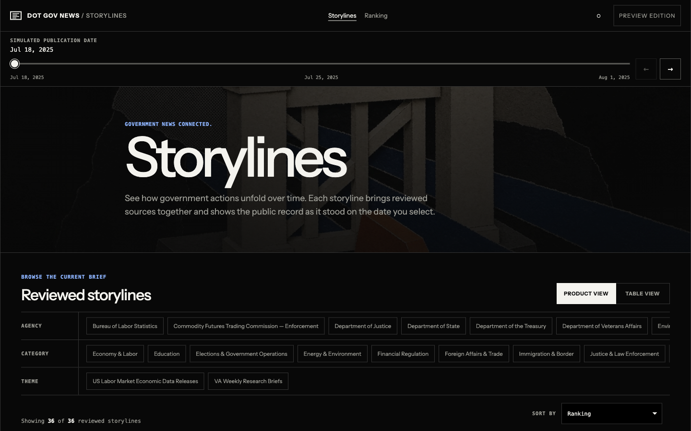
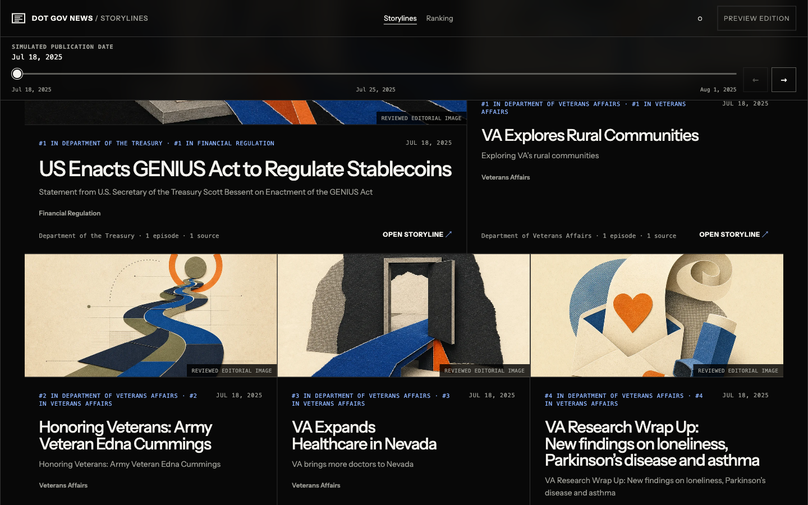

# Dot Gov News

News from official U.S. government sources, clustered into storylines you can
replay day by day. Currently seeded with 1.5 months of events from verifiable
sources as a proof of concept.

**Live demo:** [pdc-navy.vercel.app](https://pdc-navy.vercel.app/)
(shared-password preview)





## What it does

- **Inventories the federal web.** A weekly batch validates and reconciles the
  GSA Federal Website Index into Supabase — 29,569 audited source rows,
  25,367 usable `.gov` discovery targets.
- **Discovers and normalizes news sources.** RSS, Atom, JSON Feed, publisher
  APIs, HTML archives, and sitemaps all flow through one canonical
  `news_sources` model, with every raw response content-addressed in
  Cloudflare R2.
- **Builds a corpus.** Curated manifest backfills seed publisher histories
  into idempotent, replayable `news_entries`.
- **Clusters it.** A Python pipeline ([`pipeline/`](pipeline/README.md))
  embeds entries and groups them into episodes, storylines, and themes; a
  human-review loop promotes results into a golden serving dataset.
- **Generates the presentation.** Reviewed editorial card images and article
  syntheses come from
  [`apps/image_and_synthesis_gen`](apps/image_and_synthesis_gen/README.md).
- **Serves it.** The demo
  ([`apps/dot-gov-news-demo`](apps/dot-gov-news-demo/README.md)) reads the
  reviewed data through Vercel Functions and lets you scrub a simulated
  publication date to watch coverage emerge.

## How it fits together

```text
GSA Federal Website Index
    -> inventory sync (GitHub Actions)      -> government_sites
    -> site & feed discovery                -> news_sources
    -> curated corpus backfill              -> news_entries + R2 archives
    -> Python clustering (pipeline/)        -> episodes / storylines / themes
    -> human review + card generation       -> golden serving data
    -> Dot Gov News demo (Vercel)           -> pdc-navy.vercel.app
```

Durable state lives in Supabase, raw artifacts in Cloudflare R2, and
asynchronous compute on Cloudflare Workers with Cron Triggers and Queues. A
read-only operator console (`pnpm ops …`) provides health, inventory, queue,
and clustering-lab visibility.

## Status

Proof of concept: the corpus is currently seeded with 1.5 months of events
from verifiable official sources — working scaffolding and a reviewed corpus,
not yet a continuously running feed monitor. The corpus is populated by
explicit backfills and offline experiments; recurring discovery is implemented but deployed disabled
(`DISCOVERY_ENABLED=false`) while inventory review and rollout controls are
completed. Recurring source polling, learned ranking, search, and a public API
are follow-up work. [Architecture and implementation status](docs/architecture.md)
tracks the details.

## Getting started

Two commands to a working local experiment environment:

```sh
mise install && pnpm install
pnpm ops onboard
```

See the [onboarding guide](docs/onboarding.md) for prerequisites, everyday
commands, and troubleshooting. Verification, deployment, and recovery
procedures live in the [infrastructure runbook](docs/infrastructure/runbook.md).

## Repository map

| Path                                                           | Purpose                                                 |
| -------------------------------------------------------------- | ------------------------------------------------------- |
| [`apps/inventory-sync`](apps/inventory-sync)                   | GSA Federal Website Index validation and reconciliation |
| [`apps/news-backfill`](apps/news-backfill)                     | Manifest-driven corpus backfill with R2 raw archival    |
| [`apps/pipeline-worker`](apps/pipeline-worker)                 | Cloudflare Worker: heartbeat, queues, bounded discovery |
| [`apps/operator-console`](apps/operator-console)               | Read-only operator CLI, dashboard, and clustering lab   |
| [`apps/image_and_synthesis_gen`](apps/image_and_synthesis_gen) | Card thumbnail and article-synthesis generation         |
| [`apps/dot-gov-news-demo`](apps/dot-gov-news-demo)             | Public storyline reader deployed to Vercel              |
| [`pipeline/`](pipeline/README.md)                              | Python clustering: sync, prepare, cluster, experiments  |
| [`packages/contracts`](packages/contracts)                     | Shared TypeScript event and news-source contracts       |
| [`supabase/`](supabase)                                        | Migrations, roles, RLS, and database tests              |

## Documentation

- [Documentation index](docs/index.md) — start here; maps every goal to its
  guide
- [Onboarding](docs/onboarding.md)
- [Architecture and implementation status](docs/architecture.md)
- [Infrastructure runbook](docs/infrastructure/runbook.md)
- [Database guide](docs/database/README.md)
- [Clustering lab guide](docs/operations/clustering-lab.md)
- [Operator CLI cheatsheet](docs/operations/cli-cheatsheet.md)
