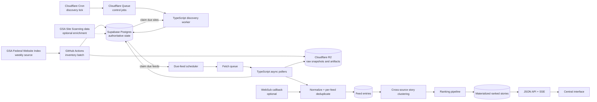
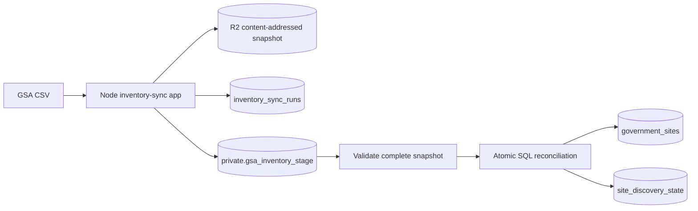
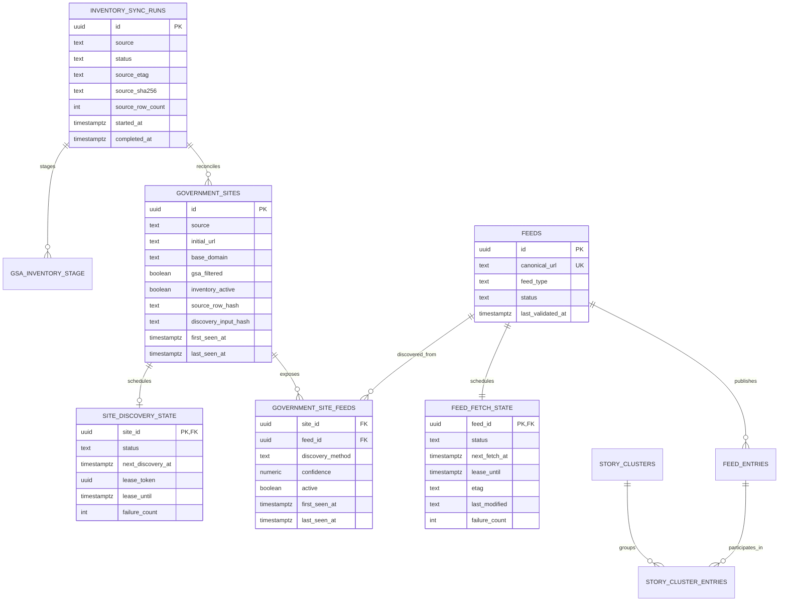

# Dot-Gov News Pipeline Architecture

**Architecture snapshot:** 2026-07-17
**Repository:** `dot-gov-news-pipeline`
**Status:** Infrastructure and GSA inventory reconciliation hosted-verified; bounded feed discovery implemented locally and provisioned disabled; polling and news processing remain planned work
**Primary design context:** Codex tasks `019f7117-db3b-7eb2-bf27-dda5fae1cf23` and `019f7129-622b-7bf3-93f1-f5de84d2e559`

This document is the architectural handoff for a new implementation session. It combines the proposed end-state design with the infrastructure that exists in this working tree. Where an older plan conflicts with code, migrations, or the hosted verification record, the repository and hosted evidence in `docs/infrastructure/runbook.md` are authoritative.

## Executive summary

The pipeline is designed as a sequence of independently schedulable stages:

1. Reconcile the weekly GSA Federal Website Index into a durable government-site inventory.
2. Visit eligible sites on a slower cadence to discover and validate RSS, Atom, or JSON Feed endpoints.
3. Maintain a canonical feed registry and poll due feeds adaptively.
4. Normalize and deduplicate new entries.
5. Cluster related entries into real-world stories, rank the clusters, and serve a materialized result to a central interface.

RSS is not a persistent stream. The default ingestion mechanism is timer-based conditional polling. WebSub or publisher-specific webhooks can reduce latency when a publisher offers them, but polling remains the universal fallback.

Supabase Postgres is the durable system of record and authoritative scheduler state. Cloudflare Cron and Queues wake bounded work; they are not the permanent backlog. R2 stores raw snapshots and large artifacts. The current Cloudflare Worker and event contract prove the asynchronous path end to end. GitHub Actions is the implemented batch runtime for the GSA inventory import because the source CSV is too CPU-heavy for the Cloudflare Workers Free budget.

TypeScript is the default implementation language for inventory, discovery, and polling because these are I/O-bound workloads and the active runtime is Cloudflare Workers. SQL owns atomic reconciliation and leasing. Python is deliberately deferred until ranking, NLP, embeddings, or analytical workloads create a concrete ecosystem advantage.

## Status at a glance

| Area                                     | Status                       | Evidence / next step                                                            |
| ---------------------------------------- | ---------------------------- | ------------------------------------------------------------------------------- |
| TypeScript monorepo and pinned toolchain | Implemented                  | pnpm workspace, Node 24 via `mise`, strict TypeScript, ESLint, Prettier, Vitest |
| Cloudflare Worker                        | Implemented and deployed     | HTTP, scheduled, and queue handlers under `apps/pipeline-worker/`               |
| Cloudflare Queue and DLQ                 | Provisioned and smoke-tested | Main queue retry and poison-message DLQ behavior recorded in the runbook        |
| Cloudflare R2                            | Provisioned and smoke-tested | Deterministic heartbeat artifact was retrieved remotely                         |
| Supabase                                 | Provisioned and migrated     | Event and GSA inventory schemas are hosted with service-role-only access        |
| End-to-end heartbeat                     | Implemented and verified     | `Cron -> Queue -> Worker -> R2 + Supabase`, including replay idempotency        |
| CI                                       | Implemented                  | App verification plus migration reset and database assertions                   |
| Chroma                                   | Local-only bootstrap         | Docker Compose with persistent named volume; not part of hosted ingestion       |
| GSA inventory sync                       | Implemented and hosted       | 29,569 rows reconciled; 25,367 usable sites; checksum replay verified unchanged |
| Site feed discovery                      | Implemented, disabled        | Lease RPCs, dedicated Queue/DLQ, bounded Worker, provenance, and canary tooling |
| Feed polling                             | Architected, not implemented | Add adaptive due-feed scheduler and stateless TypeScript pollers                |
| Entry normalization/deduplication        | Architected, not implemented | Add durable entry model and idempotent new-entry events                         |
| Clustering, ranking, API, UI             | Future                       | Keep downstream from collection and serve materialized ranked results           |

Important repository-state caveat: this snapshot includes uncommitted inventory
work on `codex/gsa-inventory-sync`, based on `origin/main`. The hosted inventory
migration and manual verification are complete, but the GitHub workflow will
not become scheduled until this branch is committed and merged into the default
branch. A new session must inspect `git status` and preserve the working tree.

## System context and end-state flow



The pipeline has two scheduling clocks that must remain separate:

```text
Website rediscovery: site_discovery_state.next_discovery_at
Feed polling:        feed_fetch_state.next_fetch_at
```

The first determines when a website should be searched for feeds. The second determines when an already-discovered feed should be fetched for new content.

## Architectural decisions

| Decision                                                          | Rationale                                                                                                                                                                                 |
| ----------------------------------------------------------------- | ----------------------------------------------------------------------------------------------------------------------------------------------------------------------------------------- |
| Supabase is the durable source of truth.                          | Inventory, leases, due times, idempotency, and provenance require transactional state. Queue retention must not determine whether work exists.                                            |
| Queues carry bounded transient work, not the complete backlog.    | At-least-once delivery, retries, DLQ behavior, and backpressure are useful; tens of thousands of long-lived queued site/feed messages are not.                                            |
| Inventory reconciliation runs in a Node/TypeScript GitHub Action. | The GSA CSV is currently roughly 8 MB and 29,000-plus rows. Streaming, hashing, parsing, staging, and validation are batch work that do not credibly fit a 10 ms Workers Free CPU budget. |
| Discovery and Cloudflare-based ingestion use TypeScript.          | The workloads are HTTP/HTML/XML/JSON orchestration, TypeScript is the mature Workers path, and the existing workspace/contracts/tooling are TypeScript.                                   |
| SQL owns reconciliation and leasing.                              | Atomic set-based changes, advisory locks, `FOR UPDATE SKIP LOCKED`, and lease validation belong next to the data.                                                                         |
| Site-to-feed is many-to-many.                                     | One site may expose several feeds, while redirects or duplicate GSA targets may advertise the same canonical feed.                                                                        |
| Delivery is at least once; writes are idempotent.                 | Exactly-once transport is unnecessary. Unique keys, lease tokens, replay-safe RPCs, and deterministic R2 object keys make retries converge.                                               |
| Polling is adaptive and timer-based.                              | External observers cannot reliably see publication events inside government infrastructure. WebSub is opportunistic, not universal.                                                       |
| Collection is separate from ranking.                              | Fetch workers should normalize facts; clustering and “interestingness” are downstream concerns that can evolve independently.                                                             |
| Chroma is currently local development infrastructure only.        | It is not required for ingestion, durability, or the hosted smoke path. A production vector-store choice remains open.                                                                    |

## Current infrastructure foundation

### Repository and runtime

The repository is a pnpm monorepo:

```text
apps/pipeline-worker/       Cloudflare Worker
apps/inventory-sync/        GSA inventory batch importer
packages/contracts/         Provider-neutral runtime-validated event contract
supabase/                   Local project config and additive SQL migrations
infra/chroma/               Local Chroma Docker Compose service
docs/infrastructure/        Access, operations, and teardown procedures
```

Node 24 is pinned with `mise`. The root package uses pnpm 11.9.0. An empty Python 3.12+ `uv` environment is retained for later workloads but is not required by the infrastructure bootstrap.

CI runs on pushes to `main` and pull requests. The application job installs the
locked pnpm dependencies and runs formatting, linting, typechecking, Vitest,
and `wrangler deploy --dry-run`. A separate database job starts local Supabase,
reapplies every migration from scratch, and runs the pgTAP suites.

### Deployed development resources

| Resource                      | Name                                               |
| ----------------------------- | -------------------------------------------------- |
| Supabase project              | `qdqmahimrnwhzdjlcont`                             |
| Cloudflare Worker             | `dot-gov-news-pipeline-dev`                        |
| Cloudflare main queue         | `dot-gov-news-events-dev`                          |
| Cloudflare DLQ                | `dot-gov-news-events-dlq-dev`                      |
| Cloudflare R2 bucket          | `dot-gov-news-artifacts-dev`                       |
| Local Chroma container/volume | `dot-gov-news-chroma` / `dot-gov-news-chroma-data` |

The operational commands, provider identifiers, secret setup, hosted evidence, and teardown sequence live in:

- `docs/infrastructure/access.md`
- `docs/infrastructure/runbook.md`
- `docs/infrastructure/teardown.md`

Do not copy secrets into this document. The Worker receives
`SUPABASE_SECRET_KEY` through Wrangler secrets and uses it only server-side. The
inventory batch uses separate bucket-scoped R2 S3 credentials. Cloudflare OAuth
is stored in the OS keychain for local work.

### Implemented heartbeat path

The current hourly Cron invokes the scheduled handler, which creates a deterministic `infra.heartbeat` event and sends it to the queue:

```text
Cloudflare Cron (0 * * * *)
    -> PIPELINE_EVENTS_QUEUE
    -> queue consumer
        -> R2 health/<event-id>.json
        -> Supabase public.pipeline_events
```

The event envelope is currently:

```ts
type PipelineEvent = {
  id: string; // UUID
  schemaVersion: 1;
  type: string;
  idempotencyKey: string;
  occurredAt: string; // offset-aware datetime
  payload: Record<string, unknown>;
};
```

Zod performs strict runtime validation. Unknown fields, malformed UUIDs, and unsupported schema versions are rejected.

The consumer writes R2 first, then upserts Supabase on `idempotency_key`, and acknowledges only after both writes succeed. Failures use bounded exponential retry. After the configured maximum of three retries, Cloudflare moves the message to the DLQ. Because the R2 key is deterministic and the database key is unique, partial failure and replay converge safely.

The hosted smoke verification completed on 2026-07-17 and proved:

- The public `/health` endpoint sees its Queue, R2, and Supabase bindings.
- A valid queue event reaches both R2 and Supabase.
- Replaying the same event retains one database row and one deterministic R2 key.
- A malformed event retries and reaches the DLQ.

R2 activation, direct artifact retrieval, and the full hosted smoke are verified in the implementation plan and infrastructure runbook.

### Existing database schema

`public.pipeline_events` contains the event ID, schema version, event type,
idempotency key, occurrence time, JSON payload, optional artifact key, and
creation time. It has:

- A unique constraint on `idempotency_key`.
- Indexes on event type/time and creation time.
- Row Level Security enabled.
- No `anon` or `authenticated` privileges.
- `SELECT`, `INSERT`, and `UPDATE` granted to `service_role`.

`pipeline_events` is diagnostic event history. It must not become the authoritative inventory, discovery backlog, or feed schedule.

The inventory migration additionally provides `inventory_sync_runs`,
`government_sites`, private per-run staging, `site_discovery_state`, and the
`usable_government_sites` view. Service-only RPCs own run lifecycle, batch
staging, atomic reconciliation, summary reads, keyset pagination, and due-site
leasing. GSA-owned site fields cannot be mutated through generic CRUD; source
reconciliation updates them and missing rows are soft-deactivated.

## Phase 1: GSA inventory reconciliation

### Source semantics

The [GSA Federal Website Index](https://github.com/GSA/federal-website-index) is an inventory of federal website targets, not a feed catalog. GSA says it is updated weekly on Wednesday at 6 p.m. Eastern. The source contains sites such as `agency.gov` and `news.agency.gov`; a separate discovery stage is required to find RSS/Atom endpoints.

GSA Site Scanning data can later enrich final URLs, redirects, CMS hints, robots, and sitemap metadata. It is an optional input and is not part of the first implementation plan.

### Runtime and schedule

The implemented scheduler is one GitHub Actions workflow:

```text
.github/workflows/gsa-inventory-sync.yml
schedule: Thursday 04:17 UTC
manual: workflow_dispatch
local: pnpm inventory:sync
```

The off-minute schedule reduces exposure to GitHub Actions' top-of-hour congestion. Scheduled Actions can be delayed or dropped, so an operator query must flag a last successful import older than eight days and `workflow_dispatch` is the recovery path.

The workflow exists only in this branch at the current snapshot. GitHub will
start evaluating its schedule after it reaches the default branch. Its
`development` environment must expose the exact variables and secrets listed in
the runbook; at the recorded verification point, `R2_ACCESS_KEY_ID` still needed
to be moved from variable scope to the secret scope consumed by the workflow.

Do not configure this same import in Cloudflare Cron or Supabase Cron. One workflow gets one scheduler.

### Reconciliation flow



The implemented run:

1. Create an `inventory_sync_runs` record.
2. Fetch the source over HTTPS with timeouts, a maximum response size, and `If-None-Match` when an earlier `ETag` exists.
3. Stream the response to a temporary file while enforcing the 20 MiB limit and calculating SHA-256.
4. Treat HTTP `304` or an already-successful checksum as a successful no-op before staging.
5. Archive each new source once in R2 under `inventory/gsa/<sha256>.csv`.
6. Analyze and parse the CSV with strict headers, booleans, hostname normalization, and bounded records.
7. Stage rows in 500-row batches keyed by `(sync_run_id, source_row_number)`.
8. Validate the entire snapshot before touching the current inventory.
9. Atomically upsert present sites, reactivate returning sites, and soft-deactivate missing sites.
10. Make new, reactivated, newly eligible, or reachability-changed sites due for discovery.
11. Persist counts and mark the run successful in the same finalization transaction.

### Safety invariants

Finalization fails without modifying current inventory when any of these is true:

- Required columns are missing.
- Normalized source keys are duplicated.
- The download or parse is incomplete.
- The staged row count differs from the recorded parsed count.
- The snapshot falls below an absolute minimum.
- The snapshot is less than 80% of the previous successful row count without an explicit human-reviewed override.
- Another GSA reconciliation holds the database advisory lock.

Missing sites are soft-deactivated, never deleted. This preserves feed, article, and provenance history if a site disappears temporarily or later returns.

All GSA records are retained for audit, but only these are discovery-eligible:

```sql
inventory_active = true
and gsa_filtered = false
and inventory_usable = true
```

`inventory_usable` is an ingestion-owned safety classification. It keeps
malformed unfiltered source values in the audit inventory while preventing
them from entering discovery; `gsa_filtered` continues to preserve GSA's own
classification unchanged.

Changes to agency/bureau labels or other non-reachability metadata should not force rediscovery. Store a full source-row hash for audit and a separate discovery-input hash for fields that change reachability or eligibility.

Inventory API access is service-only. Controlled RPCs create and close sync
runs, stage batches, finalize reconciliation, return aggregate health, and
keyset-page sites. Source-derived site rows have no generic update or hard
delete path; reconciliation owns their lifecycle.

### Implemented verification

The hosted development project contains one fully reconciled GSA snapshot:

| Result                        |  Value |
| ----------------------------- | -----: |
| Source rows                   | 29,569 |
| Usable discovery targets      | 25,367 |
| GSA-filtered rows retained    |  4,195 |
| Ingestion-excluded rows       |      7 |
| Pending site-discovery states | 25,367 |
| Duplicate usable hostnames    |      0 |

The snapshot was retrieved back from R2 and matched its recorded SHA-256. A
second run with the same checksum completed as `unchanged` without restaging or
mutating the inventory. The runbook contains run IDs, checksum, queries, and
recovery commands.

## Phase 2: Site-level feed discovery

### Scheduling model

`site_discovery_state` is a one-to-zero-or-one operational child of
`government_sites`. The inventory migration already creates and updates these
rows and implements row-level lease-safe `claim_due_site_discoveries` and
`recover_expired_site_discovery_leases` RPCs. A single claim call selects at
most one site per base domain. Cross-invocation domain serialization is an
explicit prerequisite in the discovery implementation plan and must be added
before consumer concurrency is raised above one.

No Cloudflare handler invokes those RPCs yet. The next Worker phase will add a
lightweight Cron tick that places one small `site.discovery.dispatch.requested`
control event on the queue; its consumer will claim due sites transactionally
from Supabase and perform bounded discovery.

The database is the backlog:

```text
Cron tick -> one small queue message -> claim due database rows -> process -> complete/fail lease
```

Do not enqueue all 25,000-plus sites. If a control message expires or is retried, the due rows remain in Supabase.

Initial settings:

- Claim at most one site per tick.
- Queue-consumer batch size one.
- Queue-consumer concurrency one.
- Add random jitter before contacting the site.
- Prefer the oldest due site while avoiding repeated claims from the same base domain.

At one site per minute, the maximum is 1,440 sites/day, so a full initial backfill takes roughly three weeks before retries. This rate is intentionally conservative and can be raised only after measuring domain impact, CPU, subrequests, errors, and queue cost.

### Discovery cadence

| Result or change                                  | Next discovery                                     |
| ------------------------------------------------- | -------------------------------------------------- |
| New/reactivated/newly eligible site               | Immediately                                        |
| URL, redirect, CMS, or discovery input changed    | Immediately                                        |
| Healthy site with at least one feed               | About 90 days                                      |
| No feed found                                     | 30 days for first retry, then about 90 days        |
| Transient timeout/`5xx`                           | Exponential backoff from one hour up to seven days |
| Associated feed becomes persistently invalid/gone | Immediately                                        |
| Filtered, inactive, or manually suppressed        | Disabled until eligibility changes                 |

### Discovery algorithm

For one claimed site:

1. Request `https://<initial_url>/` with bounded, validated redirects.
2. Inspect standard HTML `<link rel="alternate">` elements for RSS, Atom, and JSON Feed types.
3. Inspect explicit same-page links labeled RSS, Atom, feed, news, press releases, newsroom, alerts, or blog.
4. Visit only a small number of high-confidence same-site news pages and repeat autodiscovery.
5. Apply a small, versioned set of CMS/path heuristics only after standards-based discovery.
6. Fetch candidate feeds within strict size, timeout, redirect, and subrequest budgets.
7. Parse and validate RSS, Atom, or JSON Feed structure.
8. Canonicalize accepted URLs, upsert the feed, and record website-to-feed provenance.
9. Seed `feed_fetch_state.next_fetch_at = now()` for each newly created feed.
10. Complete or fail the discovery lease atomically.

Initial per-site bounds from the implementation plan:

- Maximum five landing/news HTML pages.
- Maximum ten feed candidates.
- Maximum five redirects per request.
- Maximum two MiB after decompression per HTML/feed response.
- Target at most 40 external subrequests for the invocation, leaving headroom below the current Workers Free limit of 50.

### Discovery security

The Worker fetches destinations influenced by external data, so it must treat every redirect and candidate as untrusted:

- Allow only HTTP and HTTPS; prefer HTTPS.
- Reject URL credentials and unexpected ports.
- Reject IP literals, loopback, private, link-local, and cloud metadata destinations.
- Revalidate redirect targets and resolved destinations.
- Limit redirects, response sizes, decompressed sizes, and total time.
- Disable XML DTDs and external entities.
- Sanitize feed-supplied HTML before any future UI rendering.
- Use a descriptive User-Agent with a project contact address.
- Enforce global, base-domain, hostname, and eventually origin/IP concurrency limits.
- Respect `Retry-After` and applicable publisher crawl guidance.

Thousands of GSA subdomains may share one agency infrastructure. Per-host limits alone are insufficient; base-domain throttling is a core requirement.

## Phase 3: Canonical feed polling

### Scheduling and worker model

One canonical feed has one `feed_fetch_state` row. A scheduler claims feeds where:

```sql
status = 'active'
and next_fetch_at <= now()
and (lease_until is null or lease_until < now())
```

Claims use short leases and `FOR UPDATE SKIP LOCKED`. Claimed feeds become transient fetch jobs on a shared queue. Stateless TypeScript workers claim whichever job is available; feeds are not permanently assigned to workers or fixed shards.

Dynamic ownership avoids hot or slow feed groups, makes worker loss recoverable, and allows horizontal scaling without resharding. If sharding is eventually necessary, base it on hostname/base domain to support publisher rate limits rather than arbitrary feed IDs.

The full-scale feed scheduler/poller deployment target is not finalized. The current Cloudflare foundation is the preferred first benchmark target, likely on Workers Paid, but async TypeScript containers remain a valid fallback if Workers CPU, connection, or queue economics are a poor fit. The language and data contracts do not depend on that deployment choice.

### Fetch behavior

Each poller should:

1. Validate the claimed lease/job.
2. Enforce global and publisher-specific concurrency.
3. Send conditional headers from stored state:

   ```http
   If-None-Match: "previous-etag"
   If-Modified-Since: Fri, 17 Jul 2026 12:00:00 GMT
   ```

4. Treat `304 Not Modified` as a successful unchanged fetch.
5. Parse changed RSS/Atom/JSON Feed with XML and size protections.
6. Identify unseen entries and insert them idempotently.
7. Optionally retain raw changed payloads in R2 for audit/debugging; do not store every unchanged response.
8. Update `ETag`, `Last-Modified`, success/error history, interval, and `next_fetch_at`.
9. Acknowledge only after durable state is updated.

### Adaptive cadence

| Observation                       | Policy                                         |
| --------------------------------- | ---------------------------------------------- |
| New entries found                 | Temporarily shorten to roughly 2–5 minutes     |
| Normally active feed              | Roughly 10–15 minutes                          |
| Repeated `304` or unchanged `200` | Gradually lengthen the interval                |
| Historically quiet feed           | Roughly 30 minutes to 6 hours                  |
| Timeout or `5xx`                  | Exponential backoff with jitter                |
| `429` or `503` with `Retry-After` | Honor `Retry-After`                            |
| Permanently missing/invalid feed  | Mark gone/invalid and trigger site rediscovery |
| WebSub available                  | Use callbacks plus a 6–24-hour safety poll     |

Every interval receives jitter to avoid synchronized bursts. RSS `<ttl>`, `skipHours`, and `skipDays` are hints, not commands.

At 27,000 feeds, average request rates are manageable for asynchronous I/O but not for the current free-tier quotas:

| Average interval | Average fetch rate |
| ---------------- | -----------------: |
| 5 minutes        | 90 requests/second |
| 10 minutes       | 45 requests/second |
| 15 minutes       | 30 requests/second |

At 90 requests/second and two-second mean latency, average network concurrency is about 180. A later load test should establish safe fleet concurrency, publisher limits, and queue age targets.

### Push optimization

We cannot observe publications inside government CMSs or server logs. Push is possible only when a publisher deliberately exposes it:

- WebSub hub and self links.
- Publisher-specific webhooks/APIs.
- A direct CMS/deployment integration.

WebSub subscriptions still require lease renewal and periodic safety polling. Therefore, push augments the polling architecture rather than replacing it.

## Phase 4: Entries, clustering, ranking, and serving

### Two distinct kinds of deduplication

Per-feed idempotency determines whether an entry has already been ingested. The identity fallback order is:

1. RSS `guid` or Atom entry ID.
2. Canonicalized article URL.
3. Hash of stable fields such as title, publication date, and content.

The database should enforce a uniqueness invariant similar to:

```text
UNIQUE(feed_id, external_entry_id)
```

Cross-source clustering is different. Several agencies or offices may publish different articles about the same real-world event. Those articles should remain as sources in one story cluster rather than being deleted as duplicates.

```text
feed entries
    -> exact/canonical deduplication
    -> semantic story clustering
    -> one cluster with multiple source records
```

### Ranking

Start with an explainable formula and collect human feedback before training a learned ranker:

```text
score = freshness
      * novelty
      * source_quality
      * corroboration
      * topic_relevance
```

Candidate signals include freshness, publication velocity, novelty, source authority/diversity, topic and geographic relevance, and explicit user feedback. Embeddings should run only for new, already-deduplicated entries, not on every feed poll.

The ranking process writes a materialized set of top stories. The API reads that prepared result rather than recomputing global rankings on every request. Use normal JSON endpoints for pages and Server-Sent Events for one-way live updates; introduce WebSockets only if the UI later needs substantial bidirectional realtime behavior.

## Proposed data model



Key ownership boundaries:

- Inventory reconciliation owns `government_sites` and eligibility-driven updates to `site_discovery_state`.
- Discovery owns `feeds`, `government_site_feeds`, and initial `feed_fetch_state` creation.
- Polling owns fetch leases, validators, cadence, and feed health in `feed_fetch_state`.
- Entry processing owns normalized entries and per-feed idempotency.
- Clustering/ranking owns story relationships and materialized ranked output.
- `pipeline_events` is diagnostic history shared across phases, not current-state ownership.

### Planned inventory and discovery tables

The detailed implementation plan proposes:

- `public.inventory_sync_runs`: every source attempt, checksum, counts, status, and bounded error details.
- `private.gsa_inventory_stage`: persistent bounded staging batches keyed by run and source row.
- `public.government_sites`: stable GSA-derived inventory and soft-deactivation history.
- `public.site_discovery_state`: due time, lease, status, failures, and last result.
- `public.feeds`: globally unique canonical feeds and validation status.
- `public.government_site_feeds`: many-to-many discovery provenance.
- `public.feed_fetch_state`: the explicit handoff to the polling phase.

Use `TIMESTAMPTZ`, database-generated UUIDs, check constraints, and narrowly targeted indexes. Public tables must have RLS enabled and no anonymous write path. Staging belongs in a non-exposed `private` schema.

### Planned database RPCs

Service-only functions should include:

- Create/start an inventory sync run.
- Stage an idempotent batch of GSA rows.
- Finalize and atomically reconcile a complete GSA snapshot.
- Claim due site discoveries with `FOR UPDATE SKIP LOCKED` and leases.
- Complete a site discovery and upsert feeds/provenance/fetch state atomically.
- Fail a discovery with bounded backoff.
- Recover expired discovery leases as part of normal claim traffic.

Any `SECURITY DEFINER` function must set an empty `search_path`, fully qualify relations, validate bounded arguments, and revoke execution from `PUBLIC`, `anon`, and `authenticated`.

Migration numbering must be reconciled before implementation. The discovery plan names `20260717000200_create_government_site_inventory.sql`, but `20260717000200_harden_pipeline_event_grants.sql` already exists. New migrations must use later unique timestamps, for example inventory `...00300` and feed discovery `...00400`; do not rename an already-applied hosted migration.

## Event and service contracts

The current `PipelineEvent` envelope is provider-neutral but not yet a discriminated event union. Before discovery work, add typed payload schemas and a dispatcher so the queue consumer routes by event type rather than treating every valid event as a heartbeat artifact.

The discovery control message should remain small:

```json
{
  "id": "uuid",
  "schemaVersion": 1,
  "type": "site.discovery.dispatch.requested",
  "idempotencyKey": "site.discovery.dispatch.requested:2026-07-17T20:01:00Z",
  "occurredAt": "2026-07-17T20:01:00Z",
  "payload": {
    "claimLimit": 1
  }
}
```

It intentionally contains no list of site IDs. The consumer claims authoritative rows from Supabase.

If Python is introduced later, do not create an in-process TypeScript/Python bridge. Use language-neutral boundaries:

```text
TypeScript producer
    -> versioned JSON contract / Supabase state / R2 object key / HTTP
Python processor
```

The current TypeScript side validates with Zod. A cross-language phase should publish JSON Schema and validate the same schema in Python with Pydantic. Large payloads belong in R2; messages carry identifiers and object keys.

## Reliability and failure semantics

### Idempotency

- Event transport is at least once.
- Queue events have stable idempotency keys.
- Database constraints provide the final duplicate guard.
- Inventory stage writes are replay-safe for an identical `(sync_run_id, source_row_number)` and reject conflicting content.
- Inventory finalization returns the stored result if a succeeded run is retried.
- Discovery completion validates a lease token and converges on globally unique canonical feed URLs.
- R2 uses deterministic/content-addressed keys.
- Feed entries use stable external identities with a unique database constraint.

### Backpressure and recovery

- Queue age and due-row age are separate signals.
- Supabase due state survives queue loss and 24-hour Free-plan retention.
- Expired leases are recovered by ordinary claim traffic.
- Individual site/feed failures update their own backoff and should not poison unrelated jobs in the same batch.
- Systemic failures such as Supabase unavailability retry the whole control message.
- Persistent poison messages move to the DLQ for inspection.
- Operators can pause Cron and queue delivery without deleting authoritative backlog state.

### Observability

Track at minimum:

- Last successful inventory sync age, source checksum, source row count, and week-over-week delta.
- Inserted, updated, reactivated, deactivated, active, filtered, and inactive site counts.
- Due, leased, expired, backoff, no-feed, and disabled discovery counts.
- Discovery success/no-feed/failure rates and oldest-due age.
- Feed candidates found, rejected, canonical feeds created, and existing feeds reused.
- Queue depth/age, retries, DLQ count, Worker CPU-limit errors, and subrequest exhaustion.
- Poll success, `304` rate, latency, bytes, parse failures, and new entries per feed.
- Publication-to-discovery and discovery-to-ranked-display latency.
- Deduplication and story-clustering ratios.
- Supabase database size and R2 storage/operation usage.

Structured logs should include event/site/feed IDs and outcomes without source payloads, credentials, or full malformed CSV rows.

## Capacity and provider constraints

As of this architecture snapshot, official provider documentation reports:

- Workers Free: 100,000 requests/day, 10 ms CPU/invocation, 50 external subrequests/invocation, 128 MB memory.
- Queues Free: 10,000 operations/day and 24-hour non-configurable retention. A successful small message normally incurs a write, read, and delete operation.
- Supabase Free: 500 MB database-size quota before read-only behavior.

These values are operating assumptions, not permanent architecture. Recheck provider limits before changing throughput or deployment topology.

At one discovery control message per minute, normal delivery costs about 4,320 queue operations/day before retries, leaving limited but useful free-tier headroom. Full feed polling is a different scale: 27,000 feeds every 15 minutes means about 2.59 million fetches/day and roughly three queue operations per fetch. Therefore, the current free Queue and Worker quotas can support the controlled discovery canary, not production polling of the full corpus.

Before enabling full polling, choose and benchmark one of:

1. Cloudflare Workers/Queues Paid with explicit cost and CPU tests.
2. A TypeScript async container fleet with another managed durable queue.
3. A hybrid in which Cloudflare handles control/webhook traffic and containers perform bulk polling.

The scheduler, message contracts, database leases, and idempotent entry model remain the same in all three options.

## Deployment and environment strategy

There is currently one development environment. Do not create staging and production variants until there is a working inventory/discovery canary and a concrete promotion need.

Current deployment is manual:

1. Apply additive Supabase migrations.
2. Set/update the Cloudflare Supabase secret interactively.
3. Dry-run the Worker bundle.
4. Deploy the Worker.
5. Verify `/health`, one valid event, replay idempotency, R2 retrieval, and DLQ behavior.

CI deployment credentials and automated deployment are intentionally deferred. If added, use least-privilege account-scoped tokens and separate migration/deploy permissions.

Backups are also a production gate. The current runbook uses manual Supabase dumps. Automated database and artifact backup/restore testing is required before valuable production data accumulates.

## Next implementation sequence

The infrastructure and inventory phases are complete. Bounded feed discovery,
typed routing, dedicated Queue bindings, and lease-aware persistence are
implemented behind `DISCOVERY_ENABLED=false`. The next step is the controlled
hosted rollout documented in `docs/operations/site-feed-discovery.md`: one
reviewed site, then 25 and 250 sites, with review between each gate. Feed polling
must be designed and benchmarked separately before consuming
`feed_fetch_state` at scale. Entry normalization, clustering/ranking, and the
materialized API/UI follow polling.

## Rollout gates

Do not enable unattended schedules until the preceding gate passes:

1. Infrastructure heartbeat passes locally and hosted. **Passed.**
2. Real GSA snapshot stages and reconciles with expected counts; replay is a no-op; malformed/truncated snapshots do not change inventory. **Passed locally and hosted.**
3. Inventory manual run is observable and recoverable. **Passed.** Merge the workflow, correct the remaining GitHub environment scope mismatch, and verify one controlled dispatch before relying on the weekly schedule.
4. Discovery fixtures cover redirects, multiple feeds, shared feeds, no-feed, malformed feed, oversized payload, SSRF target, lease expiry, and duplicate delivery.
5. Run a 25-site discovery canary and inspect every result.
6. Run a 250-site canary and evaluate errors, subrequests, domain behavior, database growth, and queue operations.
7. Expand the controlled discovery backlog.
8. Benchmark full feed polling separately; upgrade/change infrastructure before free-tier limits are approached.

## Explicit non-goals for the next inventory/discovery phase

- Polling discovered feeds for entries.
- Article-body crawling or unbounded website crawling.
- HTML-listing fallback for sites without feeds.
- WebSub subscription delivery.
- Embeddings, semantic clustering, learned ranking, or search.
- A public API, administrative dashboard, or central UI.
- Multi-region or multiple deployment environments.
- Hosted Chroma.

Keeping these out of the first domain phase prevents discovery reliability and inventory correctness from being obscured by downstream product work.

## Open decisions and known risks

1. **Full polling runtime and budget:** Cloudflare Paid versus async TypeScript containers requires a load/cost benchmark.
2. **Production vector store:** local Chroma is scaffolding, not a committed production choice. Supabase `pgvector`, hosted Chroma, or another service can be evaluated with the ranking workload.
3. **GSA Site Scanning enrichment:** useful for final URL/CMS hints, but not required for first inventory/discovery delivery.
4. **Domain-wide rate limiting across concurrent invocations:** selecting distinct base domains within one SQL claim is not sufficient across simultaneous claims. Keep discovery concurrency one until a cross-invocation domain lease/token design is tested.
5. **Feed canonicalization:** preserve path/query semantics. Do not remove trailing slashes or tracking-looking parameters without evidence that two feeds are equivalent.
6. **No-feed coverage:** sitemap and HTML change detection are separate, slower adapters, not behavior to hide inside RSS polling.
7. **Backups and data retention:** define R2 raw-payload retention and automated Supabase backup/restore before production.
8. **Plan drift:** the ignored `.claude/plans/` documents are useful design artifacts but may contain stale status. Code, applied migrations, this architecture snapshot, and the runbook take precedence.

## Handoff map

Use these files rather than reconstructing context from scratch:

- `architecture.md`: target architecture, current state, decisions, and phase boundaries.
- `.claude/plans/gsa-inventory-and-feed-discovery-implementation-plan.md`: detailed inventory/discovery tasks, tests, and original field-level proposals.
- `.claude/plans/minimal-infrastructure-bootstrap-implementation-plan.md`: original foundation plan; its R2-pending status is stale.
- `README.md`: local setup and bootstrap summary.
- `apps/inventory-sync/`: implemented GSA downloader, parser, R2 snapshot store, and reconciliation orchestration.
- `apps/pipeline-worker/`: the implemented Worker entry points and current heartbeat behavior.
- `packages/contracts/`: the current versioned Zod event envelope.
- `supabase/migrations/20260717000300_create_government_site_inventory.sql`: authoritative inventory schema, reconciliation, and discovery-claim RPCs.
- `supabase/migrations/`: the authoritative additive migration sequence.
- `docs/infrastructure/runbook.md`: resource inventory, hosted smoke evidence, operations, and incident procedures.
- `docs/infrastructure/access.md`: interactive authentication and secret handling.
- `docs/infrastructure/teardown.md`: destructive teardown order and safeguards.

Suggested next-session skills, if available: `global:backend-dev` for the TypeScript/SQL implementation, `global:testing` for migration and integration coverage, and `workers-best-practices` or `cloudflare` when changing Worker bindings, queue behavior, or external-fetch safety.

## External references

- [GSA Federal Website Index](https://github.com/GSA/federal-website-index)
- [GSA Site Scanning API](https://open.gsa.gov/api/site-scanning-api/)
- [Cloudflare Workers limits](https://developers.cloudflare.com/workers/platform/limits/)
- [Cloudflare Queues limits](https://developers.cloudflare.com/queues/platform/limits/)
- [Cloudflare Queues pricing and operation accounting](https://developers.cloudflare.com/queues/platform/pricing/)
- [Cloudflare Python Workers](https://developers.cloudflare.com/workers/languages/python/)
- [Supabase database-size behavior](https://supabase.com/docs/guides/platform/database-size)
- [GitHub Actions scheduled-workflow caveats](https://docs.github.com/en/actions/how-tos/troubleshoot-workflows)
- [HTTP conditional request semantics](https://www.rfc-editor.org/rfc/rfc9110.html#name-if-none-match)
- [W3C WebSub recommendation](https://www.w3.org/TR/websub/)
