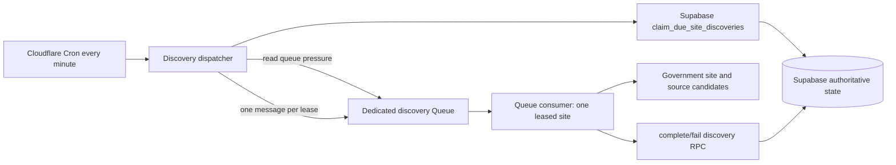

# Implementation Plan: Cloudflare Site News-Source Discovery

**Date:** 2026-07-17
**Team:** Dot-Gov News Pipeline
**Type:** New feature / infrastructure integration
**Status:** Superseded in part by the generalized news-source schema; retained
for the remaining Worker discovery design

## Handoff Snapshot

The current working branch is `codex/gsa-inventory-sync`, based on
`origin/main` commit `bf59572`. Its inventory changes are not committed yet.
The next session must preserve this work and start the discovery branch from
the committed inventory implementation, or from `main` after that work merges.
Do not start discovery from a version of `main` that lacks migration
`20260717000300_create_government_site_inventory.sql`.

Already implemented and hosted:

- `government_sites`, `site_discovery_state`, inventory run history, and
  private inventory staging.
- Weekly GSA CSV reconciliation and immutable R2 snapshot archival.
- 29,569 hosted inventory rows: 25,367 eligible/pending and 4,202 disabled.
- Service-only `claim_due_site_discoveries` and expired-lease recovery RPCs.
- Candidate selection excludes a base domain that already has an active lease,
  but the current RPC does not serialize simultaneous claim transactions.
- A TypeScript Cloudflare Worker with scheduled, Queue, R2, Supabase, logging,
  Vitest, generated binding types, and deployment validation patterns.

Not implemented:

- The discovery Queue/DLQ and dispatcher.
- Site fetching, HTML source autodiscovery, candidate validation, or URL safety.
- Canonical source persistence and site-to-source relationships.
- Discovery completion/failure/lease-release RPCs.
- Cross-invocation serialization for `claim_due_site_discoveries`; this is
  required before the database can guarantee one active lease per base domain.
- News source polling. This plan only creates its durable handoff state.

## Problem Statement

The hosted inventory correctly marks 25,367 eligible government sites as
`pending`, but no process currently claims or examines those sites. We need a
polite, bounded Cloudflare execution path that discovers RSS, Atom, JSON Feed,
publisher API, HTML archive, and sitemap sources without attempting to crawl
the entire inventory at once.

The system must remain safe under at-least-once Queue delivery, Worker failure,
publisher timeouts, concentrated government subdomains, malformed or oversized
responses, and URLs controlled by remote sites. Supabase must remain the
authoritative backlog; Cloudflare Queue must carry only near-term leased work.

## Proposed Solution

Add a one-minute Cloudflare Cron path that checks discovery Queue pressure,
atomically claims a small number of due sites from Supabase, and sends one
lease-bound `site.discovery.requested` message per claimed site to a dedicated
Queue. Initially, the claim limit, Queue batch size, and consumer concurrency
are all one.

The `00400` migration first replaces the existing claim RPC with a serialized
version using a transaction-scoped advisory lock. The Queue consumer validates
and renews the lease, performs bounded site/source
discovery, and commits one atomic completion or failure RPC. Successful
completion upserts globally canonical news sources, records the many-to-many
site/source provenance, and creates pending `news_source_fetch_state` rows for the later
polling phase.



## Requirements

1. The dispatcher never scans or enqueues the complete inventory. It claims
   only indexed, due rows through the existing service-only RPC.
2. Supabase remains the durable backlog. Losing or pausing Queue delivery must
   not lose discovery work.
3. Each Queue message contains exactly one site lease, not an arbitrary batch
   of sites.
4. Initial production settings are one claimed site per minute, Queue batch
   size one, and consumer concurrency one.
5. Active leases prevent concurrent discovery of multiple sites sharing one
   `base_domain`, including across simultaneous dispatcher invocations.
6. Queue delivery and database completion are idempotent. Stale lease tokens
   cannot update current state.
7. The Worker discovers and validates syndication, publisher API, bounded HTML
   archive, and sitemap candidates using adapter-specific behavior.
8. Every request and redirect is subject to URL, timeout, redirect, response
   size, and total subrequest budgets.
9. Site-level network/parse failures update only that site's backoff and are
   acknowledged. Systemic Supabase failures retry the Queue message.
10. Discovery completion atomically persists news sources, provenance, polling
    handoff state, and the site's next rediscovery time.
11. A failed or partial discovery never deactivates a previously valid
    site/source relationship. Deactivation requires two complete successful
    discoveries in which the relationship is absent.
12. `anon` and `authenticated` roles cannot read or mutate discovery/source
    operational tables or execute service RPCs.
13. Structured logs contain IDs, bounded status fields, timings, and counts;
    they never contain secrets or full remote response bodies.
14. Discovery can be disabled before claiming new work, and expired leases
    recover through ordinary dispatcher traffic.
15. News source polling itself is explicitly out of scope.

## Constraints and Dependencies

- Depends on migration `20260717000300_create_government_site_inventory.sql`.
  That hosted migration is immutable; discovery must use a new `00400`
  migration.
- Use TypeScript in `apps/pipeline-worker`; do not introduce a Python bridge.
- Keep the existing Supabase PostgREST client boundary. Hyperdrive is not
  needed because the Worker does not open a raw PostgreSQL connection.
- Use Cloudflare Queue bindings, not Cloudflare's REST API, inside the Worker.
- The Queue is at least once. All completion logic must therefore converge on
  database lease tokens and unique constraints.
- The initial backlog is 25,367 sites. At one successful site per minute, the
  theoretical minimum drain time is about 18 days before retries, pauses, and
  slow publishers.
- The current Workers Free plan allows only 10 milliseconds of CPU time per
  invocation. HTML/XML/JSON parsing may not fit that budget even though network
  wait time does not count. Hosted discovery must remain disabled until CPU is
  measured on representative news sources; Workers Paid is the default recommendation
  if the 10 ms gate cannot be proven reliably.
- A contact value for the discovery `User-Agent` must be configured before the
  hosted dispatcher is enabled.
- Cloudflare limits and APIs can change. The implementing session must verify
  the active account limits and current Worker/Queue types before choosing
  final numeric budgets.
- The initial Free-plan budget is viable only for discovery: one message per
  minute is approximately 4,320 Queue operations/day (write/read/delete), plus
  the existing hourly heartbeat and retries, below the 10,000/day allowance.
  Queue retention is 24 hours, but Supabase—not Queue retention—is the backlog.

## Technical Approach

### Scheduling and Backpressure

Use a dedicated producer binding and Queue:

```text
SITE_DISCOVERY_QUEUE -> dot-gov-site-discovery-dev
consumer             -> apps/pipeline-worker
DLQ                  -> dot-gov-site-discovery-dlq-dev
```

The scheduled handler distinguishes the existing hourly heartbeat Cron from a
new `* * * * *` discovery Cron using `ScheduledController.cron`.

For each discovery tick:

1. Exit with a structured `disabled` log when `DISCOVERY_ENABLED !== "true"`.
2. Read `SITE_DISCOVERY_QUEUE.metrics()` and skip claiming when its best-effort
   `backlogCount` meets the configured high-water mark. Metrics are a throttle,
   not a correctness boundary.
3. Generate a cryptographically random dispatcher/lease-owner UUID.
4. Call `claim_due_site_discoveries(worker_id, claim_limit, lease_seconds)`.
5. Convert each returned lease into one strict event with idempotency key
   `site.discovery:<site_id>:<lease_token>`.
6. Use `SITE_DISCOVERY_QUEUE.sendBatch()` with per-message delivery jitter.
7. If enqueueing throws or returns ambiguously, call the lease-release RPC for
   the affected tokens. A message that was actually accepted will later be
   rejected as stale if the site has already been reclaimed.

Supabase claim and Cloudflare enqueue cannot be one atomic transaction. Safety
comes from the lease token and compensation: a crash before enqueue leaves a
lease that ordinary claim traffic recovers after expiry; an ambiguous enqueue
releases the matching token immediately; an accepted message whose token was
released is acknowledged as stale before publisher I/O. Release never increments
failure counters or applies publisher backoff, and it is a no-op for a token that
is no longer current.

Initial configuration:

```text
DISCOVERY_ENABLED=false
DISCOVERY_CLAIM_LIMIT=1
DISCOVERY_LEASE_SECONDS=900
DISCOVERY_QUEUE_HIGH_WATER=1
DISCOVERY_MAX_DELAY_SECONDS=30
DISCOVERY_MAX_PUBLISHER_REQUESTS=36
DISCOVERY_SITE_DEADLINE_SECONDS=600
DISCOVERY_POLICY_VERSION=1
DISCOVERY_CONTACT=
```

All string configuration is parsed once per invocation through a strict helper
with bounded numeric ranges. Do not store request-specific mutable state at
module scope.

### Queue Message Contract

Add a discriminated, versioned event:

```json
{
  "id": "uuid",
  "schemaVersion": 1,
  "type": "site.discovery.requested",
  "idempotencyKey": "site.discovery:<site-id>:<lease-token>",
  "occurredAt": "2026-07-17T21:00:00.000Z",
  "payload": {
    "siteId": "uuid",
    "initialUrl": "agency.gov",
    "baseDomain": "agency.gov",
    "leaseToken": "uuid",
    "leaseUntil": "2026-07-17T21:15:00.000Z",
    "policyVersion": 1
  }
}
```

The payload is deliberately small. It contains no HTML, source bodies, lists of
sites, database credentials, or arbitrary metadata.

Evolve the current open-ended `PipelineEventSchema` into a discriminated union
containing the existing strict heartbeat event and the strict discovery event.
The Queue handler routes by both `batch.queue` and validated event `type`.

### Lease Lifecycle and Failure Semantics

Before any publisher fetch, the consumer calls `renew_site_discovery_lease`.
The RPC returns the new `lease_until` only when the site ID and lease token still
match an unexpired `leased` row that remains inventory-eligible. A false/stale
result is logged and acknowledged without network work. The renewed lease must
extend beyond the configured overall discovery deadline plus cleanup headroom.

End states:

| Outcome | Queue action | Database action |
| --- | --- | --- |
| Valid news sources found | Acknowledge | Atomic completion; `succeeded`; schedule rediscovery |
| Complete generalized scan, no source | Acknowledge | Atomic completion; `no_news_source`; schedule rediscovery |
| Required/root request timeout, `429`, `5xx`, or oversized body | Acknowledge after persistence | `fail_site_discovery`; bounded `backoff` |
| Individual malformed/unsafe source candidate | Continue, then acknowledge | Reject candidate; complete only if the bounded scan otherwise finishes |
| Root URL rejected by safety policy | Acknowledge after persistence | Non-retryable failure with a long bounded retry |
| Deadline/request budget exhausted before the scan finishes | Acknowledge after persistence | `fail_site_discovery`; never age out prior relationships |
| Supabase unavailable before result persistence | Retry message | Leave lease to retry/expiry recovery |
| Worker crash | Cloudflare redelivers | Lease token prevents conflicting completion |
| Invalid message | Retry to configured DLQ | No database mutation |
| Stale lease/token | Acknowledge | No database mutation |

`Retry-After` may influence backoff only after parsing a bounded delta/date and
clamping it to the database policy. The Worker does not calculate arbitrary
future timestamps for successful rediscovery; the completion/failure RPCs own
cadence.

### Discovery Algorithm

For one valid lease:

1. Construct `https://<initial_url>/` and request it through the bounded fetch
   utility. Permit an HTTP fallback only for a documented TLS/network failure.
2. Follow redirects manually with `redirect: "manual"`, validating every
   target before the next request.
3. Inspect the response `Link` header and HTML `<link rel="alternate">`
   elements for RSS, Atom, and JSON Feed media types.
4. Inspect same-page anchors whose URL or bounded text indicates RSS, Atom,
   source, news, press releases, newsroom, alerts, or blog.
5. Visit at most three high-confidence landing pages on the same base domain
   and repeat standards-based autodiscovery.
6. Only then try a small versioned conventional-path list on the official
   hostname, such as `/source`, `/rss`, `/rss.xml`, `/source.xml`, and `/atom.xml`.
7. Deduplicate candidate URLs before fetching and validate at most ten.
8. Validate the final bounded body as RSS, Atom, or JSON Feed. Content type is
   evidence, not proof.
9. Canonicalize accepted final URLs and return bounded source metadata plus the
   discovery method.
10. Commit exactly one completion or failure RPC.

A scan is complete only when every candidate selected by the bounded policy has
reached a terminal accepted/rejected result. A transient candidate-fetch error,
deadline, or request-budget exhaustion makes the scan partial: call the failure
RPC, do not increment relationship-miss counters, and do not deactivate prior
relationships. The first implementation may discard newly found news sources from a
partial scan and rediscover them on retry rather than adding a second partial
persistence path.

Initial per-site policy:

- One root page and at most three additional HTML landing pages.
- At most ten distinct source candidates.
- At most five redirects per request.
- At most 36 publisher `fetch()` attempts total, counting every redirect hop and
  HTTPS-to-HTTP fallback. Reserve at least four external subrequests for the
  Supabase renew/result RPCs and overhead, keeping the invocation at or below 40
  against the current Workers Free limit of 50.
- Two MiB maximum buffered body after decompression for HTML or source
  validation; lower the bound if hosted measurements justify it.
- Per-request timeout plus an overall site-discovery deadline shorter than the
  renewed lease.
- External source URLs are accepted only when explicitly linked by an official
  page; conventional-path guessing stays on the official hostname/base domain.
- Request chains and source candidates are processed sequentially; do not use
  unbounded or candidate-wide `Promise.all` calls.

Use native `HTMLRewriter` for HTML extraction. Buffer XML/JSON only through a
bounded stream reader that cancels the response after the byte limit. Never
call `response.text()` or `response.json()` on an unbounded remote response.
Use a Workers-compatible XML parser configured with DTD/external entity
processing disabled; pin the dependency and verify the Worker bundle before
merging.

### URL Safety and Canonicalization

Every root URL, candidate, and redirect target must pass the same policy:

- Allow only `http:` and `https:`.
- Reject embedded credentials, fragments for fetch identity, unsupported
  ports, malformed IDNs, and overlong URLs.
- Reject `localhost`, `.localhost`, `.local`, cloud metadata hostnames, and IP
  literals in loopback, private, link-local, multicast, unspecified, or other
  non-public ranges for both IPv4 and IPv6.
- Resolve relative URLs only against the validated final page URL.
- Do not visit discovered landing pages outside the GSA site's base domain.
- Allow an explicit cross-origin source candidate only when it came from the
  official page's `Link`, alternate link, or explicit anchor—not from guessed
  paths.
- Revalidate all manual redirect locations.

Canonical source URLs lowercase scheme/host, convert the hostname through the
URL implementation, remove fragments and default ports, and preserve path,
trailing slash, and query semantics. The final validated redirect URL is the
canonical candidate; the originally advertised URL remains in relationship
provenance.

### Rediscovery Cadence

Database-owned initial policy:

| Result | Next state and due time |
| --- | --- |
| At least one validated source | `succeeded`, approximately 90 days |
| Complete generalized scan with no source, first occurrence | `no_news_source`, 30 days |
| Repeated complete generalized no-source result | `no_news_source`, approximately 90 days |
| Transient timeout, `429`, or `5xx` | `backoff`, exponential 1 hour to 7 days |
| Non-retryable URL/safety failure | `backoff` with long bounded retry for inspection |
| Inventory URL/eligibility input changes | Existing inventory finalizer resets to `pending` immediately |
| Inventory-ineligible site | `disabled`, no due time |

Add deterministic bounded jitter so thousands of sites do not become due at
the same instant after a fixed interval.

## Data Model Changes

Create `supabase/migrations/20260717000400_create_feed_discovery.sql`. Do not
edit the hosted `00300` migration.

### `public.news_sources`

- `id UUID PRIMARY KEY DEFAULT gen_random_uuid()`
- `canonical_url TEXT NOT NULL UNIQUE CHECK (length(canonical_url) BETWEEN 1 AND 2048)`
- `source_type TEXT NOT NULL CHECK IN ('rss', 'atom', 'json_feed', 'publisher_api', 'html_archive', 'sitemap')`
- `title TEXT NULL CHECK (length(title) <= 512)`
- `home_page_url TEXT NULL CHECK (length(home_page_url) <= 2048)`
- `status TEXT NOT NULL CHECK IN ('active', 'invalid', 'gone', 'suppressed')`
- `last_http_status INTEGER NULL CHECK BETWEEN 100 AND 599`
- `first_seen_at`, `last_seen_at`, `last_validated_at`, `created_at`, and
  `updated_at TIMESTAMPTZ NOT NULL DEFAULT now()`

### `public.government_site_news_sources`

- `site_id UUID REFERENCES government_sites(id) ON DELETE CASCADE`
- `news_source_id UUID REFERENCES news_sources(id) ON DELETE CASCADE`
- `discovery_method TEXT NOT NULL` with a versioned allowed-value check
- `discovery_url TEXT NOT NULL CHECK (length(discovery_url) BETWEEN 1 AND 2048)`
- `active BOOLEAN NOT NULL DEFAULT true`
- `missing_success_count INTEGER NOT NULL DEFAULT 0`
- `first_seen_at`, `last_seen_at`, `updated_at TIMESTAMPTZ`
- `PRIMARY KEY (site_id, news_source_id)`

This is the many-to-many provenance layer. One site can advertise multiple
news sources, and multiple GSA sites can converge on one canonical source.

### `public.news_source_fetch_state`

Create the polling handoff but no polling consumer:

- `news_source_id UUID PRIMARY KEY REFERENCES news_sources(id) ON DELETE CASCADE`
- `status TEXT NOT NULL CHECK IN ('pending', 'leased', 'active', 'backoff', 'disabled')`
- `next_fetch_at TIMESTAMPTZ NULL`
- `lease_token UUID NULL`, `lease_owner UUID NULL`, and
  `lease_until TIMESTAMPTZ NULL`, with a constraint requiring all three exactly
  when status is `leased` and none otherwise
- `etag TEXT NULL CHECK (length(etag) <= 1024)`
- `last_modified TEXT NULL CHECK (length(last_modified) <= 1024)`
- `last_success_at TIMESTAMPTZ NULL`
- `last_new_item_at TIMESTAMPTZ NULL`
- `failure_count INTEGER NOT NULL DEFAULT 0`
- `updated_at TIMESTAMPTZ NOT NULL DEFAULT now()`

New news sources receive `status = 'pending'` and `next_fetch_at = now()`. Only a later
source-polling implementation may claim or mutate polling state.

### `public.site_discovery_state` additions

Add only fields needed for bounded health/audit information:

- `last_final_url TEXT NULL`
- `last_http_status INTEGER NULL CHECK BETWEEN 100 AND 599`
- `last_duration_ms INTEGER NULL CHECK >= 0`
- `last_policy_version INTEGER NULL CHECK > 0`

Bound `last_final_url` to 2,048 characters and `last_duration_ms` to the maximum
configured lease duration. Do not store response bodies in Postgres.

### Service-only RPCs

Add and test:

- Replace `claim_due_site_discoveries(p_worker_id UUID, p_claim_limit INTEGER,
  p_lease_seconds INTEGER)` without changing its signature. Acquire a
  transaction-scoped global advisory lock before recovery/selection; return no
  rows if another claim transaction owns the lock. This serializes the existing
  active-base-domain exclusion and closes its cross-invocation race.
- `renew_site_discovery_lease(p_site_id UUID, p_lease_token UUID,
  p_lease_seconds INTEGER) RETURNS TIMESTAMPTZ`; return the renewed deadline, or
  no row for stale/expired/ineligible work.
- `release_site_discovery_lease(p_site_id UUID, p_lease_token UUID,
  p_reason_code TEXT) RETURNS BOOLEAN`; matching enqueue compensation returns
  the row to immediately due `pending` without incrementing failures.
- `complete_site_discovery(p_site_id UUID, p_lease_token UUID, p_result TEXT,
  p_site_health JSONB, p_sources JSONB, p_policy_version INTEGER) RETURNS BOOLEAN`.
- `fail_site_discovery(p_site_id UUID, p_lease_token UUID, p_error_code TEXT,
  p_error_detail TEXT, p_retry_after_seconds INTEGER,
  p_policy_version INTEGER) RETURNS BOOLEAN`.
- `get_site_discovery_summary()` for operator/API reads
- Keep using the existing `recover_expired_site_discovery_leases` behavior.

All mutating RPCs validate lease ownership, current eligibility, bounded JSON
shape/count/string lengths, unique canonical URLs within the input, and allowed
enum values. A stale token returns no mutation rather than raising a retryable
error. Completion accepts only `succeeded` or `no_news_source` after a complete scan and
atomically:

1. Upserts each canonical source.
2. Upserts and reactivates observed site/source relationships.
3. Creates missing `news_source_fetch_state` rows without overwriting poller-owned
   fields.
4. Increments `missing_success_count` only after a complete successful scan;
   deactivates a relationship after two consecutive complete misses.
5. Clears the lease, records health/result fields, resets failure state, and
   computes the next due time.

Use `SECURITY DEFINER`, `search_path = ''`, fully qualified relations, RLS, and
explicit revoke/grant statements. Grant execution and table reads only to
`service_role`; never grant generic table inserts/updates/deletes.

## API and Contract Changes

Supabase exposes service RPCs under `/rest/v1/rpc/<function_name>`. They are
internal server-to-server endpoints, not public browser CRUD.

Create or update:

- `packages/contracts/src/site-discovery-event.ts`
- `packages/contracts/src/pipeline-event.ts`
- `packages/contracts/src/index.ts`
- `packages/contracts/test/site-discovery-event.test.ts`

Create a Worker repository boundary rather than scattering `.rpc()` calls:

- `apps/pipeline-worker/src/clients/site-discovery-repository.ts`
- `apps/pipeline-worker/test/site-discovery-repository.test.ts`

The repository exposes typed `claim`, `renew`, `release`, `complete`, `fail`,
and `summary` methods. Runtime-validate scalar UUIDs, count fields, and returned
claim rows before they reach network code.

## Implementation Steps

### 1. Establish the dependent branch and freeze decisions

**Complexity:** Small
**Dependencies:** Inventory branch committed or merged

Verify the branch includes:

- `supabase/migrations/20260717000300_create_government_site_inventory.sql`
- `apps/pipeline-worker/src/handlers/scheduled.ts`
- `apps/pipeline-worker/src/handlers/queue.ts`
- `apps/pipeline-worker/wrangler.jsonc`
- Hosted inventory counts recorded in `docs/infrastructure/runbook.md`

Create the new discovery branch from that commit. Treat this document as the
scope contract: discovery plus polling handoff, but no source polling or entry
processing.

**Deliverable:** A clean dependent branch with the inventory foundation and no
edits to applied migrations.

### 2. Add source persistence and lease lifecycle migration

**Complexity:** Large
**Dependencies:** Step 1

Create:

- `supabase/migrations/20260717000400_create_feed_discovery.sql`
- `supabase/tests/database/feed_discovery.test.sql`

Implement the tables, indexes, RLS/grants, state health columns, and RPCs from
the data model section. Reuse the `SECURITY DEFINER` hardening pattern from
`00300`. `CREATE OR REPLACE` the existing claim RPC with the same argument and
return types, adding the transaction-scoped claim lock before its current
expired-lease recovery and base-domain filtering. Revoke and re-grant its exact
signature explicitly in `00400`.

Database tests must cover canonical URL uniqueness, site/source many-to-many
relationships, new polling handoff rows, lease-token mismatch, lease renewal,
enqueue release, success/no-source cadence, backoff caps, retry-after clamping,
two-successful-misses deactivation, failed-scan preservation, ineligible-site
rejection, and anonymous denial. Add a two-client integration test that invokes
the claim RPC concurrently and proves that committed active leases never share a
base domain; a single-call distinct-domain test is not sufficient.

**Deliverable:** PostgreSQL can safely complete or fail discovery independent
of Queue retries.

### 3. Add strict discovery event contracts

**Complexity:** Medium
**Dependencies:** Step 1

Modify/create the contract files listed under API changes. Preserve the
existing heartbeat behavior while making both known event payloads strict and
discriminated. Add valid, malformed, unknown-type, oversized-string, and stale
timestamp fixtures.

**Deliverable:** Dispatcher and consumer share a versioned, provider-neutral,
runtime-validated lease message.

### 4. Add the Worker discovery repository and configuration parser

**Complexity:** Medium
**Dependencies:** Steps 2 and 3

Create:

- `apps/pipeline-worker/src/clients/site-discovery-repository.ts`
- `apps/pipeline-worker/src/discovery/discovery-config.ts`
- `apps/pipeline-worker/test/site-discovery-repository.test.ts`
- `apps/pipeline-worker/test/discovery-config.test.ts`

Update:

- `apps/pipeline-worker/src/env.ts`
- `apps/pipeline-worker/.dev.vars.example`

Wrap all Supabase RPCs and strictly parse configuration bounds. Do not log the
Supabase key, remote payloads, or full URLs containing query strings. Refuse to
dispatch when discovery is enabled but `DISCOVERY_CONTACT` is blank or cannot be
rendered into a bounded descriptive `User-Agent`.

**Deliverable:** Worker orchestration uses a mockable, typed persistence
boundary and safe configuration defaults.

### 5. Implement Cron dispatch with Queue backpressure

**Complexity:** Medium
**Dependencies:** Steps 3 and 4

Create:

- `apps/pipeline-worker/src/discovery/dispatch-due-sites.ts`
- `apps/pipeline-worker/test/dispatch-due-sites.test.ts`

Update:

- `apps/pipeline-worker/src/handlers/scheduled.ts`
- `apps/pipeline-worker/test/heartbeat.test.ts`

Route the two Cron expressions explicitly. Implement enabled/disabled behavior,
Queue metrics high-water skipping, bounded claims, stable idempotency keys,
cryptographic IDs, per-message delivery jitter, `sendBatch`, and lease release
on enqueue failure. Treat Queue metrics as approximate and test every
claim/enqueue boundary: crash before enqueue relies on expiry; definite or
ambiguous enqueue failure invokes token-matching release; an accepted message
after release becomes stale and performs no publisher fetch.

**Deliverable:** One Cron tick creates no more than the configured number of
lease-bound Queue messages and never scans the inventory.

### 6. Implement bounded fetch, redirects, and URL safety

**Complexity:** Large
**Dependencies:** Step 4

Create:

- `apps/pipeline-worker/src/discovery/discovery-budget.ts`
- `apps/pipeline-worker/src/discovery/url-safety.ts`
- `apps/pipeline-worker/src/discovery/bounded-fetch.ts`
- `apps/pipeline-worker/src/discovery/discovery-policy.ts`
- `apps/pipeline-worker/test/discovery-budget.test.ts`
- `apps/pipeline-worker/test/url-safety.test.ts`
- `apps/pipeline-worker/test/bounded-fetch.test.ts`

Use `AbortSignal.timeout` or an equivalent supported Worker API, manual
redirects, streaming byte accounting, early body cancellation, and a single
cumulative request budget passed through all discovery functions. Confirm the
exact APIs against generated Worker types during implementation. The budget
counts the initial request, HTTP fallback, and every redirect hop; tests enforce
the 36-publisher-request cap and the 40-total-external-subrequest design bound.

**Deliverable:** No discovery path can issue an unbounded number of requests,
follow an unvalidated redirect, or buffer an unbounded response.

### 7. Implement standards-first source extraction and validation

**Complexity:** Large
**Dependencies:** Step 6

Create:

- `apps/pipeline-worker/src/discovery/extract-source-links.ts`
- `apps/pipeline-worker/src/discovery/generate-source-candidates.ts`
- `apps/pipeline-worker/src/discovery/validate-source.ts`
- `apps/pipeline-worker/src/discovery/canonicalize-source-url.ts`
- `apps/pipeline-worker/src/discovery/discover-site-news-sources.ts`
- `apps/pipeline-worker/test/source-autodiscovery.test.ts`
- `apps/pipeline-worker/test/source-validation.test.ts`
- `apps/pipeline-worker/test/source-canonicalization.test.ts`
- `apps/pipeline-worker/test/fixtures/discovery/`

Implement the ordered algorithm and bounds above. Add fixture coverage for
RSS 2.0, RSS 1.0/RDF, Atom, JSON Feed, empty-but-valid news sources, relative links,
HTTP `Link` headers, multiple news sources, external explicitly linked news sources,
redirects, malformed XML/JSON, DTD/entity input, huge content-length, streamed
oversize bodies, unsupported schemes, unsafe IPs, and duplicate canonical URLs.

**Deliverable:** A deterministic function returns bounded validated candidates
and site health without database side effects.

### 8. Implement the discovery Queue consumer and routing

**Complexity:** Large
**Dependencies:** Steps 3, 4, and 7

Create:

- `apps/pipeline-worker/src/discovery/process-site-discovery.ts`
- `apps/pipeline-worker/src/handlers/site-discovery-queue.ts`
- `apps/pipeline-worker/test/process-site-discovery.test.ts`

Refactor/update:

- `apps/pipeline-worker/src/handlers/queue.ts`
- `apps/pipeline-worker/src/index.ts`
- `apps/pipeline-worker/test/heartbeat.test.ts`

Route heartbeat and discovery Queues without weakening heartbeat durability.
For discovery: validate, renew, fetch, complete/fail, then acknowledge. Retry
only systemic persistence failures. Ensure every promise is awaited and every
message is explicitly acknowledged or retried. A partial scan caused by a
transient candidate error, deadline, or budget exhaustion must use `fail`, not
`complete`, so relationship-miss counters cannot advance.

**Deliverable:** One Queue invocation safely resolves one leased site and
duplicate/stale delivery converges.

### 9. Provision and configure the dedicated Queue safely

**Complexity:** Medium
**Dependencies:** Steps 5 and 8

Provision:

- `dot-gov-site-discovery-dev`
- `dot-gov-site-discovery-dlq-dev`

Update:

- `apps/pipeline-worker/wrangler.jsonc`
- `apps/pipeline-worker/worker-configuration.d.ts` by running Wrangler types
- `docs/infrastructure/runbook.md`
- `docs/infrastructure/teardown.md`

Add the producer binding, consumer, DLQ, minute Cron, batch size one,
concurrency one, bounded retries, and observability. Keep
`DISCOVERY_ENABLED=false` for the first hosted deployment. Do not hand-edit
generated binding types. Record the current Free-plan constraints in the
runbook: 10 ms CPU/invocation, 10,000 Queue operations/day, 24-hour Queue
retention, 50 external subrequests per Worker invocation, and 128 MiB Worker
memory; re-verify them at implementation time. If the account is upgraded,
configure and test `limits.cpu_ms` deliberately rather than assuming its value.

**Deliverable:** A dry-run deploy validates all bindings, but hosted Cron cannot
claim work until explicitly enabled.

### 10. Add operational queries and health reporting

**Complexity:** Medium
**Dependencies:** Steps 2 and 8

Create:

- `supabase/queries/discovery-health.sql`
- `supabase/queries/prepare-discovery-canary.sql`
- `docs/operations/site-source-discovery.md`

Update:

- `apps/pipeline-worker/src/handlers/health.ts`
- `docs/infrastructure/runbook.md`
- `architecture.md`

Expose only secret-safe binding/config status through `/health`. Document
queries for status counts, oldest due age, lease age/expiry, completion rates,
error codes, news sources created, relationships reused, and Queue/DLQ inspection.
The canary query must run transactionally as an operator: defer non-cohort due
rows, make exactly the selected 25 or 250 site IDs due, and include the inverse
restore statement. This prevents a minute Cron from silently draining beyond a
review gate while Cloudflare trigger/config changes propagate.
Do not write every discovery event into `pipeline_events`; current state lives
in discovery/source tables and event detail lives in structured Worker logs.

**Deliverable:** An operator can distinguish a paused dispatcher, Queue
backlog, stuck leases, publisher failures, and valid no-source outcomes.

### 11. Verify locally and execute a staged hosted canary

**Complexity:** Large
**Dependencies:** All prior steps

Create as needed:

- `apps/pipeline-worker/test/site-discovery.integration.test.ts`
- `.github/workflows/ci.yml` updates

Local gates:

```sh
mise exec -- pnpm format:check
mise exec -- pnpm lint
mise exec -- pnpm typecheck
mise exec -- pnpm test
mise exec -- pnpm supabase db reset
mise exec -- pnpm supabase test db
mise exec -- pnpm supabase db lint --level warning
mise exec -- pnpm --filter @dot-gov-news/pipeline-worker check:deploy
```

Hosted rollout:

1. Apply `00400` with discovery disabled and verify migration catalogs.
2. Provision Queue/DLQ and deploy bindings with `DISCOVERY_ENABLED=false`.
3. Exercise one manually selected real site through the Queue while Cron remains
   disabled; local fixtures are not hosted publisher endpoints. Record Worker
   CPU time, wall time, peak response bytes, and subrequest count. If the active
   plan's CPU limit cannot be met with reliable headroom, keep discovery disabled
   and upgrade or redesign the execution runtime before continuing.
4. Use the transactional canary query to make exactly 25 reviewed sites due and
   defer the rest, then enable claim limit one and concurrency one.
5. Inspect every error class, redirect, candidate rejection, created source, lease
   transition, Queue retry, and DLQ result. Require no stuck leases, no
   unbounded-body errors, and no cross-base-domain overlap.
6. Disable dispatch, restore/defer with the canary query, and expose exactly 250
   sites only after the 25-site review passes.
7. Keep one site/minute until oldest-due age, duration, subrequest count,
   publisher errors, and Queue backlog show safe headroom.
8. Disable dispatch after the 250-site review, restore the full due backlog,
   then explicitly re-enable the minute Cron for the full rollout.
9. Record hosted counts, policy version, Worker deployment version, and any
   changed numeric bounds in the runbook.

**Deliverable:** Discovery is enabled only after a human-reviewed bounded
canary; scaling is an explicit later decision.

## Testing Strategy

### Unit tests

- Strict event/config parsing and stable idempotency keys.
- Queue high-water and disabled paths.
- URL/IP/port/credential/redirect safety.
- Global request, byte, redirect, candidate, and deadline budgets.
- HTML and HTTP-header extraction.
- RSS, Atom, and JSON Feed structural validation.
- Canonicalization without destructive path/query rewriting.
- Error classification and bounded diagnostic strings.

### Database tests

- RLS and function execution grants.
- Lease renewal, expiry, release, and stale-token rejection.
- Atomic completion and failure transitions.
- Canonical source uniqueness and many-to-many provenance.
- Duplicate completion and duplicate Queue delivery.
- Two successful misses before relationship deactivation.
- Failed/partial discovery preserving known relationships.
- News source polling state seeded once and not overwritten.
- Rediscovery cadence, jitter, and backoff caps.

### Integration tests

- Cron -> claim -> enqueue with mocked Queue/repository.
- Queue message -> renew -> mocked network -> completion.
- Site failure -> backoff -> acknowledgement.
- Supabase failure -> Queue retry -> lease recovery.
- Inventory change invalidating an outstanding lease.
- Two different sites discovering one canonical source.

### Required quality gates

- Generated Worker binding types match Wrangler configuration.
- No `any`, double-casts used to hide binding errors, floating promises, or
  request-scoped global mutable state in production code.
- Remote response bodies are bounded before decoding/parsing.
- Worker dry-run bundle and local Worker-pool tests pass.
- Database tests pass when local inventory tables are already populated.

## Rollout and Rollback

### Rollout

1. Merge/apply schema first.
2. Provision the dedicated Queue and DLQ.
3. Deploy Worker code with discovery disabled.
4. Run the 1/25/250-site canary gates.
5. Enable the minute dispatcher at one site per tick.
6. Raise claim limit or consumer concurrency only in a separately reviewed
   change backed by measurements and base-domain concurrency tests.

### Pause/rollback

- Set `DISCOVERY_ENABLED=false` and deploy before removing bindings.
- Pause the Queue consumer if external traffic must stop immediately.
- Leave due/backoff rows intact; they are the recoverable backlog.
- Allow active leases to expire or run the token-aware release/recovery path.
- Roll back Worker code without rolling back `00400`; additive unused tables
  and RPCs are safe to retain.
- Do not delete news sources or relationships during rollback.

## Acceptance Criteria

- A minute Cron tick claims at most the configured limit and sends one job per
  site without scanning all pending rows.
- Queue backlog pressure prevents additional claims.
- No two active leases share one base domain.
- A valid site transitions `pending -> leased -> succeeded|no_news_source` and receives
  a future `next_discovery_at`.
- A transient site failure transitions to bounded `backoff` without retrying or
  poisoning unrelated sites.
- A stale or duplicate Queue message cannot overwrite a newer lease/result.
- Valid RSS, Atom, and JSON Feed candidates are persisted and related to their
  source sites.
- Shared canonical news sources produce one `news_sources` row and multiple provenance rows.
- Newly discovered news sources receive pending polling state, but no polling occurs.
- Unsafe targets, redirect loops, oversized bodies, and exhausted budgets stop
  cleanly and produce bounded diagnostics.
- Hosted 25-site and 250-site canaries pass before the full backlog is enabled.

## Open Questions and Locked Defaults

The implementation can proceed with these defaults; change them only with an
explicit review:

- **Contact/User-Agent:** unresolved configuration value; blocks hosted enablement
  but not local implementation.
- **Cross-origin news sources:** allowed only when explicitly linked by the official
  page; never guessed cross-origin.
- **Cadence:** 90 days after success, 30 then 90 days after no-source, exponential
  one hour to seven days after transient failure.
- **Throughput:** one claim/minute, one Queue message/invocation, concurrency one.
- **Runtime tier:** do not enable the backlog on Workers Free unless the hosted
  canary proves the 10 ms CPU limit with headroom; Workers Paid is the default
  recommendation if it does not.
- **Fetching boundary:** create `news_source_fetch_state`; do not fetch news items.
- **Notion:** intentionally skipped; this is the local handoff artifact requested
  for another coding session.

## References

- Repository architecture: `architecture.md`
- Inventory/discovery predecessor plan:
  `docs/archive/implementation-plans/gsa-inventory-and-news-source-discovery-implementation-plan.md`
- Hosted inventory runbook: `docs/infrastructure/runbook.md`
- Cloudflare Workers best practices:
  <https://developers.cloudflare.com/workers/best-practices/workers-best-practices/>
- Cloudflare Cron Triggers:
  <https://developers.cloudflare.com/workers/configuration/cron-triggers/>
- Cloudflare Queue batching/retries:
  <https://developers.cloudflare.com/queues/configuration/batching-retries/>
- Cloudflare Queue limits:
  <https://developers.cloudflare.com/queues/platform/limits/>
- Cloudflare Queue pricing and operation accounting:
  <https://developers.cloudflare.com/queues/platform/pricing/>
- Cloudflare Worker limits:
  <https://developers.cloudflare.com/workers/platform/limits/>
