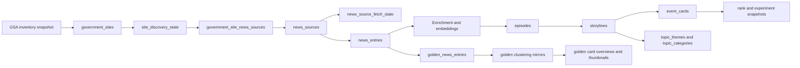
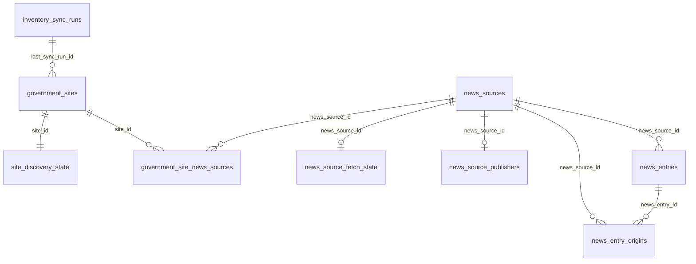
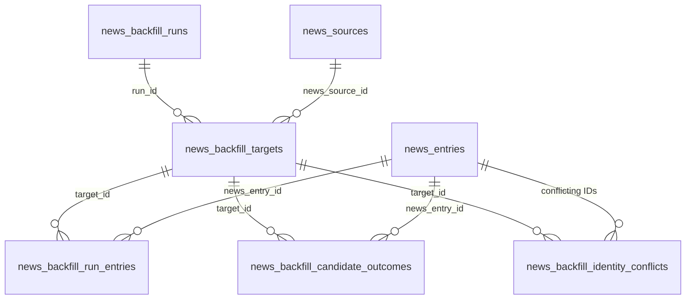
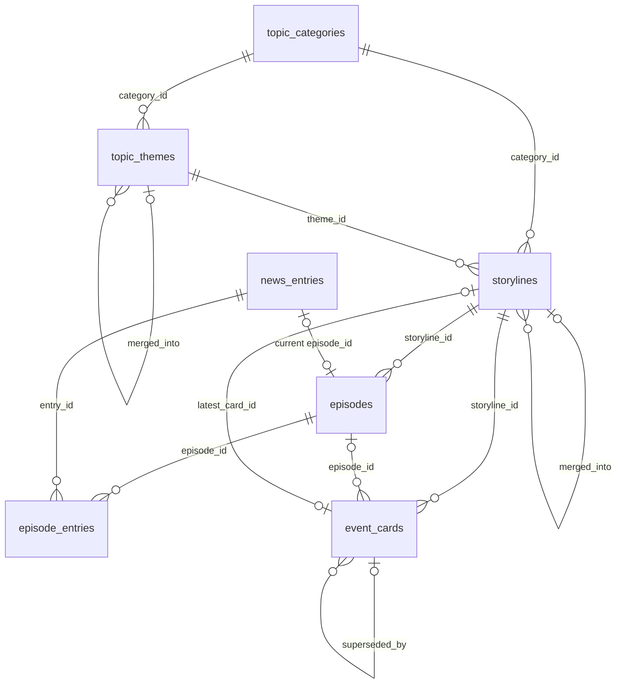
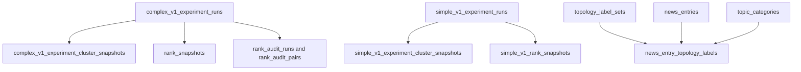
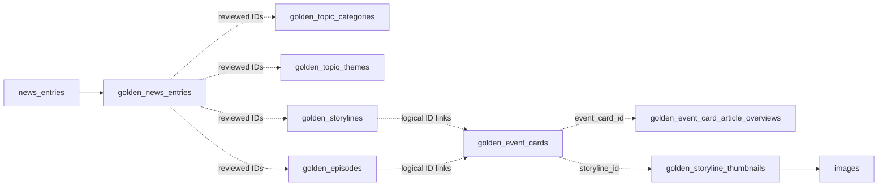

# Database Relationships and Lifecycle

This guide shows how the durable tables fit together. It emphasizes ownership
and reset boundaries; consult the [schema reference](schema-reference.md) for
columns and the migrations for executable constraints.

## End-to-end data lifecycle

`pipeline_events` sits beside this flow as diagnostic history. It records that
work happened but is not the source of truth for inventory, leases, corpus
entries, or clustering state.

## Inventory, discovery, and sources

Key design points:

- Inventory reconciliation owns GSA fields. Missing sites are soft-deactivated
  instead of deleted.
- Discovery state is one-to-one with a site and is deleted if that site is
  deliberately deleted.
- Site/source provenance is many-to-many. A site may expose multiple sources,
  and one canonical source may be advertised by multiple sites.
- Fetch state and publisher identity are optional one-to-one extensions of a
  canonical source.
- A canonical entry has one primary `news_source_id`; `news_entry_origins`
  retains all observed source identities for syndicated content.
- A source referenced by entries or backfill history is protected by
  `ON DELETE RESTRICT`.

`usable_government_sites` is a filtered read model over `government_sites`, not
independent state.

## Backfill ownership

A run owns its targets; a target owns its checkpoint and audit records. Those
ownership edges cascade on delete. References to canonical sources and entries
are restrictive so deleting operational history cannot silently delete corpus
data, and deleting corpus data cannot erase an unresolved audit trail.

Candidate records are keyed by `(target_id, candidate_key)`, making repeated
ingestion converge on the same decision. Raw artifact keys point to Cloudflare
R2; PostgreSQL does not enforce the external object's existence.

## Clustering and cards

Important distinctions:

- `episode_entries` is the normalized membership/evidence record.
  `news_entries.episode_id` is a convenient current-assignment pointer.
- `episodes.storyline_id` owns the episode-to-storyline relationship.
- `storylines.latest_card_id` is a read optimization; all card history remains
  in `event_cards` and card versions link through `superseded_by`.
- Overview cards have no episode; episode cards must reference one.
- Category and theme links are nullable while classification is pending.
- Merge pointers retain loser rows for traceability rather than deleting them.

There are two intentional reference cycles:

1. `storylines.latest_card_id` points to `event_cards`, while cards point back
   to their storyline.
2. `news_entries.episode_id` points to `episodes`, while `episode_entries`
   points back to entries.

Use the pipeline reset commands or purpose-built RPCs instead of ad hoc delete
statements. A manual reset must null the denormalized pointers before deleting
the referenced cluster rows.

## Experiment and evaluation boundaries

Deleting an experiment run cascades to its namespaced snapshot and ranking or
audit children. Snapshot payloads are immutable after capture; annotations can
change without rewriting the evidence.

Rank snapshots intentionally store storyline and card UUIDs without foreign
keys to live cluster tables. Experiments remain reproducible after a pipeline
reset. Topology labels take the opposite approach: they cascade with the label
set or canonical entry and record the entry content hash to detect stale
labels.

The complex-v1 and simple-v1 families must not reference one another. Their
similar schemas are a versioned interface, not an invitation to merge their
rows into generic experiment tables.

## Golden data boundary

Only `golden_news_entries.news_entry_id` has a database-enforced foreign key to
live corpus state. The golden mirror tables deliberately do not enforce foreign
keys to live clustering tables—or even between mirror tables—so a reviewed
snapshot is self-contained and can survive live resets.

The dashed edges are logical and must be validated by curation/export tests.
Article enrichment uses logical `event_card_id` links. Thumbnail enrichment
uses one logical `storyline_id` association plus an enforced image foreign key,
so every card version in a chain resolves the same immutable asset.

## Delete and reset behavior

| Parent               | Children that cascade                                   | References that restrict or require ordering                                        |
| -------------------- | ------------------------------------------------------- | ----------------------------------------------------------------------------------- |
| `government_sites`   | discovery state, site/source provenance                 | inventory run remains referenced by site                                            |
| `news_sources`       | site/source provenance, fetch state, publisher identity | entries, entry origins, and backfill targets restrict deletion                      |
| `news_entries`       | entry origins and topology labels                       | backfill audits, episode membership, cards, and golden review can restrict deletion |
| `news_backfill_runs` | targets and all target-owned audits                     | canonical sources and entries remain                                                |
| experiment run       | matching cluster/rank/audit snapshots                   | snapshot IDs do not own live clusters                                               |
| topology label set   | entry labels                                            | categories remain                                                                   |

Clustering tables generally use restrictive foreign keys rather than cascade,
because accidental deletion would erase explainability. Use
`uv run python -m pipeline.cli reset` for supported live-cluster cleanup and
review its dry-run/output before operating on valuable data.

## Rebuild verification checklist

After a clean migration replay:

1. verify RLS is enabled on every public application table;
2. verify only the three corpus relations have the `corpus_read` policy;
3. query `usable_government_sites` successfully;
4. run the migration transition harness and all pgTAP tests;
5. confirm snapshot immutability triggers reject payload rewrites;
6. confirm service-only RPCs execute only under intended roles;
7. confirm dropped feed-only and generic experiment relations are absent.

The commands for this checklist are in the [database guide](README.md#rebuild-a-local-database-from-nothing).
